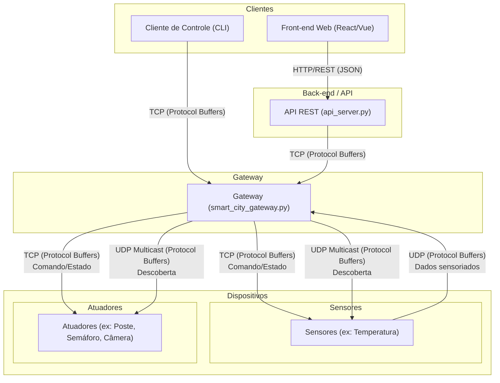

# Projeto de Simulação de Cidade Inteligente

Este projeto implementa um sistema distribuído para simular o monitoramento e controle de uma cidade inteligente. A solução é composta por um Gateway central, diversos dispositivos inteligentes (sensores e atuadores) e clientes para interação com o sistema.

O objetivo é aplicar conceitos de sistemas distribuídos, incluindo comunicação via sockets TCP/UDP, serialização de dados com Protocol Buffers e descoberta de serviços por meio de multicast UDP.

## Arquitetura

A arquitetura do sistema foi projetada para ser modular e escalável, separando as responsabilidades em componentes distintos. O diagrama abaixo ilustra os principais componentes e os fluxos de comunicação entre eles.



### Descrição dos Componentes

  * **Dispositivos Inteligentes**: Simulam os equipamentos da cidade e são implementados como processos separados.

      * **Sensores**: Enviam dados de forma periódica para o Gateway via UDP. Ex: Sensor de Temperatura.
      * **Atuadores**: Recebem comandos do Gateway via TCP para alterar seu estado (ex: ligar/desligar um poste) e reportam seu estado atual. Ex: Poste, Câmera, Semáforo.

  * **Gateway**: É o ponto central de controle e monitoramento do ambiente. Suas principais responsabilidades são:

      * Realizar a descoberta de dispositivos ativos na rede enviando uma mensagem multicast UDP.
      * Gerenciar o estado dos dispositivos e enviar comandos utilizando TCP.
      * Receber dados periódicos dos sensores via UDP.

  * **Cliente de Controle (CLI)**: Uma interface de linha de comando que permite ao usuário interagir com o sistema. Ele se conecta ao Gateway via TCP para:

      * Consultar os estados dos dispositivos conectados.
      * Enviar comandos para dispositivos específicos, como ligar/desligar um poste ou ajustar uma configuração.

  * **API REST**: Este servidor atua como uma ponte entre o mundo HTTP e o ecossistema interno do Gateway. Ele recebe requisições de clientes web, as traduz para o formato Protocol Buffers e as encaminha para o Gateway via TCP. Essa abordagem permite a implementação de interfaces gráficas.

  * **Front-end Web**: Uma interface gráfica web que consome a API REST. Essa implementação atende ao requisito opcional de fornecer uma interface visual para o usuário.

## Comunicação e Serialização

Para garantir a interoperabilidade e a eficiência da comunicação, o sistema adota os seguintes padrões:

  * **Protocol Buffers**: Todas as mensagens trocadas entre os componentes do sistema (Cliente-Gateway e Gateway-Dispositivos) são serializadas utilizando Protocol Buffers.
  * **TCP**: Utilizado para comunicações que exigem confiabilidade, como o envio de comandos de controle do Cliente para o Gateway e do Gateway para os Atuadores.
  * **UDP**: Usado para o envio de informações periódicas e não críticas dos Sensores para o Gateway, como leituras de temperatura.
  * **UDP Multicast**: Empregado para o mecanismo de descoberta, onde o Gateway envia uma única mensagem para um grupo de multicast e todos os dispositivos na escuta podem se identificar.

---

## Protocolo de Comunicação (`.proto`)

O arquivo [`src/proto/smart_city.proto`](src/proto/smart_city.proto) define o **protocolo de comunicação** do sistema, especificando a sintaxe (estrutura e tipos das mensagens) e parte da semântica (significado dos campos e mensagens) trocadas entre os componentes, utilizando Protocol Buffers. Esse protocolo garante que clientes, gateway e dispositivos falem a mesma "linguagem", independentemente da linguagem de programação utilizada.

O protocolo de comunicação do sistema é composto por:
- **Sintaxe:** Definida pelo arquivo `.proto`, que descreve os campos, tipos e formatos das mensagens.
- **Semântica e regras de interação:** Definidas pela arquitetura do sistema, que estabelece quem envia cada mensagem, quando, e como os participantes devem reagir a cada tipo de mensagem.

### Principais Mensagens e Fluxos

- **Descoberta de Dispositivos (UDP Multicast)**
  - `DiscoveryRequest`: enviada pelo Gateway para a rede, solicitando que dispositivos se apresentem.
  - `DeviceInfo`: resposta dos dispositivos ao Gateway, informando tipo, IP, porta, capacidades e estado inicial.
  - **Exemplo de fluxo:**  
    1. Gateway envia `DiscoveryRequest` via multicast UDP.
    2. Dispositivos respondem com `DeviceInfo` via UDP unicast.

- **Comunicação Gateway ↔ Dispositivos**
  - `DeviceUpdate`: sensores enviam dados periódicos ao Gateway (UDP), atuadores reportam estado (TCP).
    - Exemplo de payload para sensor de temperatura:
      ```json
      {
        "device_id": "temp01",
        "type": "TEMPERATURE_SENSOR",
        "current_status": "ACTIVE",
        "temperature_humidity": {
          "temperature": 23.5,
          "humidity": 60.0
        }
      }
      ```
    - Exemplo de payload para atuador (poste):
      ```json
      {
        "device_id": "poste01",
        "type": "POST",
        "current_status": "ON"
      }
      ```
  - `DeviceCommand`: comando do Gateway para um atuador (ex: ligar/desligar, alterar configuração).
    - Exemplo:
      ```json
      {
        "device_id": "poste01",
        "type": "POST",
        "command_type": "TURN_OFF",
        "command_value": "OFF"
      }
      ```

- **Comunicação Cliente ↔ Gateway**
  - `ClientRequest`: mensagem do cliente para o Gateway (listar dispositivos, consultar status, enviar comando).
    - Exemplo para listar dispositivos:
      ```json
      {
        "type": "LIST_DEVICES"
      }
      ```
    - Exemplo para enviar comando:
      ```json
      {
        "type": "SEND_DEVICE_COMMAND",
        "target_device_id": "poste01",
        "command": {
          "device_id": "poste01",
          "type": "POST",
          "command_type": "TURN_ON",
          "command_value": "ON"
        }
      }
      ```
  - `GatewayResponse`: resposta do Gateway ao cliente (lista de dispositivos, status, confirmação de comando ou erro).
    - Exemplo de resposta com lista de dispositivos:
      ```json
      {
        "type": "DEVICE_LIST",
        "devices": [
          {
            "device_id": "temp01",
            "type": "TEMPERATURE_SENSOR",
            "ip_address": "192.168.0.10",
            "port": 5001,
            "initial_state": "ACTIVE"
          },
          {
            "device_id": "poste01",
            "type": "POST",
            "ip_address": "192.168.0.11",
            "port": 5002,
            "initial_state": "OFF"
          }
        ]
      }
      ```

### Extensibilidade

- Novos tipos de dispositivos podem ser adicionados facilmente nas enums `DeviceType` e `DeviceStatus`.
- Campos específicos para cada tipo de sensor/atuador são definidos usando `oneof`, permitindo evolução sem quebrar compatibilidade.
- O mesmo arquivo `.proto` é usado para gerar código em Python e Java, garantindo padronização.

### Geração de Código

```bash
# Para Python
protoc --python_out=src/proto/ src/proto/smart_city.proto

# Para Java
protoc --java_out=CAMINHO/DESTINO src/proto/smart_city.proto
```

---

## Estrutura do Projeto

```
.
├── src
│   ├── api/                  # (Opcional) Abstrações de comunicação
│   │   ├── actuators/        # Atuadores (Java)
│   │   │   └── AlarmActuator.java
│   │   └── sensors/          # Sensores (Java)
│   │       └── TemperatureHumiditySensor.java
│   ├── client-test/          # Cliente de teste (Python)
│   │   └── smart_city_client.py
│   ├── gateway/              # Gateway (Python)
│   │   ├── smart_city_gateway.py
│   │   └── state.py
│   └── proto/                # Definições Protocol Buffers (.proto) e código gerado
│       ├── smart_city.proto
│       └── smart_city_pb2.py (gerado, não versionado)
├── target/                   # JARs gerados pelo Maven
├── pom.xml                   # Configuração Maven (Java)
├── requirements.txt          # Dependências Python
├── .gitignore
└── README.md
```

---

## Requisitos

- **Java 21 LTS**
- **Apache Maven 3.9.x**
- **Python 3.x**
- **protoc (Protocol Buffers Compiler)**
- **Git**

---

## Configuração do Ambiente

### Java

1. Instale o JDK 21.
2. Instale o Maven.
3. Compile e gere os JARs:
   ```bash
   mvn clean package
   ```
   Isso irá gerar:
   - `target/temperature-humidity-sensor.jar`
   - `target/alarm-actuator.jar`

### Python

1. Crie e ative o ambiente virtual:
   ```bash
   python3 -m venv venv
   source venv/bin/activate
   ```
2. Instale as dependências:
   ```bash
   pip install -r requirements.txt
   ```
3. Gere o código Python do Protobuf:
   ```bash
   protoc --python_out=src/proto/ src/proto/smart_city.proto
   ```

---

## Execução dos Componentes

### 1. Gateway (Python)

Na raiz do projeto:
```bash
source venv/bin/activate
python3 -m src.gateway.smart_city_gateway
```

### 2. Cliente (Python)

Em outro terminal, na raiz do projeto:
```bash
source venv/bin/activate
python3 src/client-test/smart_city_client.py
```

### 3. Sensor de Temperatura/Umidade (Java)

Em outro terminal:
```bash
cd target
java -jar temperature-humidity-sensor.jar sensor01
```

### 4. Atuador de Alarme (Java)

Em outro terminal:
```bash
cd target
java -jar alarm-actuator.jar atua01
```

---

## Observações

- O arquivo `src/proto/smart_city_pb2.py` é gerado automaticamente e não é versionado.
- IDs dos dispositivos agora são exatamente os argumentos passados na linha de comando.
- O sistema suporta múltiplos tipos de dispositivos, facilmente extensível via `.proto`.
- Para adicionar novos dispositivos, edite o arquivo `.proto` e gere novamente os códigos.