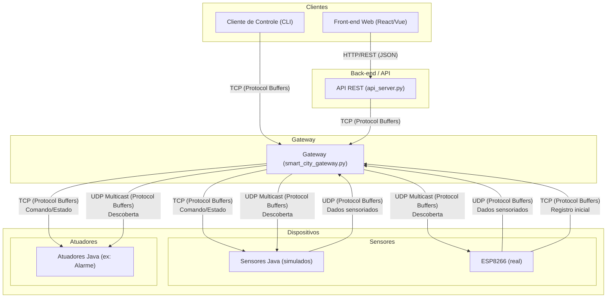

# Projeto de Simulação de Cidade Inteligente

Este projeto implementa um sistema distribuído para simular o monitoramento e controle de uma cidade inteligente. A solução é composta por um Gateway central, diversos dispositivos inteligentes (sensores e atuadores) e clientes para interação com o sistema.

O objetivo é aplicar conceitos de sistemas distribuídos, incluindo comunicação via sockets TCP/UDP, serialização de dados com Protocol Buffers e descoberta de serviços por meio de multicast UDP.

## Status do Sistema

✅ **Sistema 100% Funcional** - Todos os componentes estão operacionais e testados:

- ✅ **Gateway Python:** Processando dispositivos e clientes
- ✅ **Dispositivos Java:** Sensores e atuadores simulados funcionando
- ✅ **ESP8266:** Sensor real de temperatura/umidade integrado
- ✅ **Cliente CLI:** Interface de controle funcional
- ✅ **Protocol Buffers:** Serialização funcionando em todos os componentes
- ✅ **Descoberta Multicast:** Funcionando corretamente
- ✅ **Comunicação TCP/UDP:** Implementada conforme especificação

## Arquitetura

A arquitetura do sistema foi projetada para ser modular e escalável, separando as responsabilidades em componentes distintos. O diagrama abaixo ilustra os principais componentes e os fluxos de comunicação entre eles.



### Descrição dos Componentes

  * **Dispositivos Inteligentes**: Simulam os equipamentos da cidade e são implementados como processos separados.

      * **Sensores**: Enviam dados de forma periódica para o Gateway via UDP. Ex: Sensor de Temperatura (Java) e ESP8266 (real).
      * **Atuadores**: Recebem comandos do Gateway via TCP para alterar seu estado (ex: ligar/desligar um alarme) e reportam seu estado atual. Ex: Alarme Java.

  * **Gateway**: É o ponto central de controle e monitoramento do ambiente. Suas principais responsabilidades são:

      * Realizar a descoberta de dispositivos ativos na rede enviando uma mensagem multicast UDP.
      * Gerenciar o estado dos dispositivos e enviar comandos utilizando TCP.
      * Receber dados periódicos dos sensores via UDP.

  * **Cliente de Controle (CLI)**: Uma interface de linha de comando que permite ao usuário interagir com o sistema. Ele se conecta ao Gateway via TCP para:

      * Consultar os estados dos dispositivos conectados.
      * Enviar comandos para dispositivos específicos, como ligar/desligar um alarme.

  * **API REST**: Este servidor atua como uma ponte entre o mundo HTTP e o ecossistema interno do Gateway. Ele recebe requisições de clientes web, as traduz para o formato Protocol Buffers e as encaminha para o Gateway via TCP. Essa abordagem permite a implementação de interfaces gráficas.

  * **Front-end Web**: Uma interface gráfica web que consome a API REST. Essa implementação atende ao requisito opcional de fornecer uma interface visual para o usuário.

## Comunicação e Serialização

Para garantir a interoperabilidade e a eficiência da comunicação, o sistema adota os seguintes padrões:

  * **Protocol Buffers**: Todas as mensagens trocadas entre os componentes do sistema (Cliente-Gateway e Gateway-Dispositivos) são serializadas utilizando Protocol Buffers.
  * **TCP**: Utilizado para comunicações que exigem confiabilidade, como o envio de comandos de controle do Cliente para o Gateway e do Gateway para os Atuadores.
  * **UDP**: Usado para o envio de informações periódicas e não críticas dos Sensores para o Gateway, como leituras de temperatura.
  * **UDP Multicast**: Empregado para o mecanismo de descoberta, onde o Gateway envia uma única mensagem para um grupo de multicast e todos os dispositivos na escuta podem se identificar.

---

## Protocolo de Comunicação (`.proto`)

O arquivo [`src/proto/smart_city.proto`](src/proto/smart_city.proto) define o **protocolo de comunicação** do sistema, especificando a sintaxe (estrutura e tipos das mensagens) e parte da semântica (significado dos campos e mensagens) das mensagens trocadas entre os componentes, utilizando Protocol Buffers. Esse protocolo garante que clientes, gateway e dispositivos falem a mesma "lingua", independentemente da linguagem de programação utilizada.

O protocolo de comunicação do sistema é composto por:
- **Sintaxe:** Definida pelo arquivo `.proto`, que descreve os campos, tipos e formatos das mensagens.
- **Semântica e regras de interação:** Definidas pela arquitetura do sistema, que estabelece quem envia cada mensagem, quando, e como os participantes devem reagir a cada tipo de mensagem.

### Principais Mensagens e Fluxos

- **Descoberta de Dispositivos (UDP Multicast)**
  - `DiscoveryRequest`: enviada pelo Gateway para a rede, solicitando que dispositivos se apresentem.
  - `DeviceInfo`: resposta dos dispositivos ao Gateway, informando tipo, IP, porta, capacidades e estado inicial.
  - **Exemplo de fluxo:**  
    1. Gateway envia `DiscoveryRequest` via multicast UDP.
    2. Dispositivos respondem com `DeviceInfo` via TCP.

- **Comunicação Gateway ↔ Dispositivos**
  - `DeviceUpdate`: sensores enviam dados periódicos ao Gateway (UDP), atuadores reportam estado (TCP).
    - Exemplo de payload para sensor de temperatura:
      ```json
      {
        "device_id": "esp8266_temp_01",
        "type": "TEMPERATURE_SENSOR",
        "current_status": "ACTIVE",
        "temperature_humidity": {
          "temperature": 23.5,
          "humidity": 60.0
        }
      }
      ```
    - Exemplo de payload para atuador (alarme):
      ```json
      {
        "device_id": "alarm_001",
        "type": "ALARM",
        "current_status": "ON"
      }
      ```
  - `DeviceCommand`: comando do Gateway para um atuador (ex: ligar/desligar, alterar configuração).
    - Exemplo:
      ```json
      {
        "device_id": "alarm_001",
        "type": "ALARM",
        "command_type": "TURN_OFF",
        "command_value": "OFF"
      }
      ```

- **Comunicação Cliente ↔ Gateway**
  - `ClientRequest`: mensagem do cliente para o Gateway (listar dispositivos, consultar status, enviar comando).
    - Exemplo para listar dispositivos:
      ```json
      {
        "type": "LIST_DEVICES"
      }
      ```
    - Exemplo para enviar comando:
      ```json
      {
        "type": "SEND_DEVICE_COMMAND",
        "target_device_id": "alarm_001",
        "command": {
          "device_id": "alarm_001",
          "type": "ALARM",
          "command_type": "TURN_ON",
          "command_value": "ON"
        }
      }
      ```
  - `GatewayResponse`: resposta do Gateway ao cliente (lista de dispositivos, status, confirmação de comando ou erro).
    - Exemplo de resposta com lista de dispositivos:
      ```json
      {
        "type": "DEVICE_LIST",
        "devices": [
          {
            "device_id": "esp8266_temp_01",
            "type": "TEMPERATURE_SENSOR",
            "ip_address": "192.168.5.114",
            "port": 8889,
            "initial_state": "ACTIVE"
          },
          {
            "device_id": "alarm_001",
            "type": "ALARM",
            "ip_address": "192.168.1.100",
            "port": 5002,
            "initial_state": "OFF"
          }
        ]
      }
      ```

### Extensibilidade

- Novos tipos de dispositivos podem ser adicionados facilmente nas enums `DeviceType` e `DeviceStatus`.
- Campos específicos para cada tipo de sensor/atuador são definidos usando `oneof`, permitindo evolução sem quebrar compatibilidade.
- O mesmo arquivo `.proto` é usado para gerar código em Python, Java e C++ (nanopb), garantindo padronização.

### Geração de Código

```bash
# Para Python
protoc --python_out=src/proto/ src/proto/smart_city.proto

# Para Java
protoc --java_out=CAMINHO/DESTINO src/proto/smart_city.proto

# Para ESP8266 (nanopb)
protoc --nanopb_out=esp8266-projects/smart-city-sensor/ esp8266-projects/smart-city-sensor/smart_city_esp8266.proto
```

---

## Estrutura do Projeto

```
.
├── src
│   ├── api/                  # API REST (opcional)
│   │   ├── requirements.txt
│   │   └── src/
│   │       └── api_server.py
│   ├── client-test/          # Cliente CLI de teste
│   │   └── smart_city_client.py
│   ├── devices/              # Dispositivos Java
│   │   ├── actuators/        # Atuadores
│   │   │   └── AlarmActuator.java
│   │   └── sensors/          # Sensores
│   │       └── TemperatureHumiditySensor.java
│   ├── front-end/            # Interfaces web (opcional)
│   │   ├── atv-SD/          # Front-end Vue.js
│   │   └── smart-city-front/ # Front-end React
│   ├── gateway/              # Gateway central
│   │   ├── smart_city_gateway.py
│   │   └── state.py
│   └── proto/                # Definições Protocol Buffers
│       ├── smart_city.proto
│       └── smart_city_pb2.py
├── esp8266-projects/         # Firmware ESP8266
│   └── smart-city-sensor/    # Sensor de temperatura real
│       ├── smart-city-sensor.ino
│       ├── smart_city_esp8266.proto
│       ├── platformio.ini
│       └── README.md
├── bin/                      # Binários e ferramentas
├── requirements.txt          # Dependências Python
├── pom.xml                   # Configuração Maven (Java)
└── README.md                 # Este arquivo
```

## Pré-requisitos

- **Python 3.8+** com pip
- **Java 21+** com Maven
- **Protocol Buffers** (protoc)
- **ESP8266** (NodeMCU) + PlatformIO (opcional)
- **Arduino CLI** (para ESP8266)

## Instalação e Configuração

### 1. Configurar Ambiente Python

    ```bash
# Criar ambiente virtual
python3 -m venv venv
source venv/bin/activate  # Linux/Mac
# ou
venv\Scripts\activate     # Windows

# Instalar dependências
pip install -r requirements.txt
```

### 2. Configurar Ambiente Java

    ```bash
# Compilar dispositivos Java
mvn clean package

# Os JARs serão gerados em src/devices/actuators/ e src/devices/sensors/
```

### 3. Gerar Código Protocol Buffers

    ```bash
# Gerar código Python
protoc --python_out=src/proto/ src/proto/smart_city.proto

# Gerar código Java (se necessário)
protoc --java_out=src/proto/ src/proto/smart_city.proto
```

### 4. Configurar ESP8266 (Opcional)

        ```bash
cd esp8266-projects/smart-city-sensor
# Ver README.md específico do ESP8266 para instruções detalhadas
```

## Execução do Sistema

### 1. Iniciar o Gateway

```bash
# Ativar ambiente virtual
source venv/bin/activate

# Executar Gateway
python3 -m src.gateway.smart_city_gateway
```

### 2. Iniciar Dispositivos Java

```bash
# Terminal 1 - Sensor de Temperatura
java -jar src/devices/sensors/TemperatureHumiditySensor.jar

# Terminal 2 - Atuador de Alarme
java -jar src/devices/actuators/AlarmActuator.jar
```

### 3. Testar com Cliente CLI

    ```bash
# Terminal 3 - Cliente de teste
python3 src/client-test/smart_city_client.py
```

### 4. ESP8266 (Opcional)

O ESP8266 deve ser programado e conectado à rede WiFi. Ele se descobrirá automaticamente via multicast e começará a enviar dados.

## Funcionalidades Testadas

✅ **Descoberta de Dispositivos:** Multicast UDP funcionando
✅ **Registro de Dispositivos:** DeviceInfo via TCP
✅ **Dados Sensoriados:** DeviceUpdate via UDP (Java + ESP8266)
✅ **Controle de Atuadores:** DeviceCommand via TCP
✅ **Interface Cliente:** Listagem e consulta de status
✅ **Protocol Buffers:** Serialização em Python, Java e C++ (nanopb)
✅ **Sistema Real:** ESP8266 integrado e funcionando

## Exemplos de Uso

### Listar Dispositivos Conectados
```
--- Menu do Cliente SmartCity ---
1. Listar Dispositivos
2. Ligar Alarme (TURN_ON)
3. Desligar Alarme (TURN_OFF)
4. Consultar Status de um Dispositivo
0. Sair

Escolha uma opção: 1

--- Dispositivos Conectados ---
  ID: esp8266_temp_01, Tipo: TEMPERATURE_SENSOR, IP: 192.168.5.114:8889, Status: ACTIVE
  ID: alarm_001, Tipo: ALARM, IP: 192.168.1.100:5002, Status: OFF
```

### Consultar Status de Sensor
```
Escolha uma opção: 4
ID do Dispositivo: esp8266_temp_01

--- Status de 'esp8266_temp_01' ---
  Tipo: TEMPERATURE_SENSOR
  Status Atual: ACTIVE
  Temperatura: 23.5°C
  Umidade: 60.0%
```

### Controlar Atuador
```
Escolha uma opção: 2
ID do Dispositivo: alarm_001

Comando TURN_ON enviado para alarm_001
Status: SUCCESS
```

## Desenvolvimento e Expansão

### Adicionar Novo Tipo de Dispositivo

1. **Atualizar Protocol Buffers:**
   ```proto
   enum DeviceType {
     // ... tipos existentes
     NEW_DEVICE = 9;
   }
   ```

2. **Implementar Dispositivo Java:**
   - Criar classe que implementa o protocolo
   - Gerar JAR com dependências

3. **Atualizar Gateway:**
   - Adicionar lógica específica se necessário

### Adicionar Novo Campo de Dados

1. **Atualizar .proto:**
   ```proto
   message DeviceUpdate {
     // ... campos existentes
     NewData new_data = 10;
   }
   ```

2. **Regenerar código:**
        ```bash
   protoc --python_out=src/proto/ src/proto/smart_city.proto
   ```

3. **Atualizar implementações** nos dispositivos

## Troubleshooting

### Problemas Comuns

- **Dispositivo não aparece:** Verificar se multicast está funcionando
- **Erro de conexão:** Verificar portas e firewall
- **Dados não atualizam:** Verificar se dispositivo está enviando via UDP
- **ESP8266 não conecta:** Verificar credenciais WiFi no firmware

### Logs Úteis

        ```bash
# Verificar dispositivos na rede
sudo tcpdump -i any udp port 5007

# Monitorar comunicação TCP
sudo tcpdump -i any tcp port 12345

# Verificar dados UDP
sudo tcpdump -i any udp port 12346
```

## Contribuição

1. Fork o projeto
2. Crie uma branch para sua feature
3. Commit suas mudanças
4. Push para a branch
5. Abra um Pull Request

## Licença

Este projeto é parte de um trabalho acadêmico de Sistemas Distribuídos.