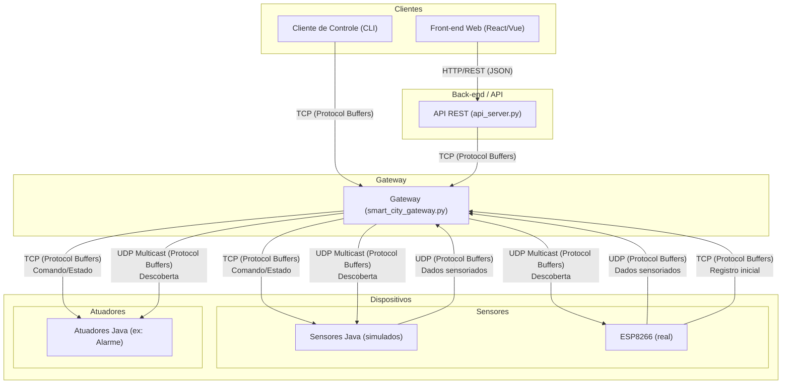

# Projeto de Simulação de Cidade Inteligente

Este projeto implementa um sistema distribuído para simular o monitoramento e controle de uma cidade inteligente. A solução é composta por um Gateway central, diversos dispositivos inteligentes (sensores e atuadores) e clientes para interação com o sistema.

O objetivo é aplicar conceitos de sistemas distribuídos, incluindo comunicação via sockets TCP/UDP, serialização de dados com Protocol Buffers e descoberta de serviços por meio de multicast UDP.

## Status do Sistema

✅ **Sistema 100% Funcional** - Todos os componentes estão operacionais e testados:

- ✅ **Gateway Python:** Processando dispositivos e clientes
- ✅ **Dispositivos Java:** Sensores e atuadores simulados funcionando
- ✅ **ESP8266:** Sensor real de temperatura/umidade integrado
- ✅ **Cliente CLI:** Interface de controle funcional
- ✅ **Protocol Buffers:** Serialização funcionando em todos os componentes
- ✅ **Descoberta Multicast:** Funcionando corretamente
- ✅ **Comunicação TCP/UDP:** Implementada conforme especificação

## Arquitetura

A arquitetura do sistema foi projetada para ser modular e escalável, separando as responsabilidades em componentes distintos. O diagrama abaixo ilustra os principais componentes e os fluxos de comunicação entre eles.



### Descrição dos Componentes

  * **Dispositivos Inteligentes**: Simulam os equipamentos da cidade e são implementados como processos separados.

      * **Sensores**: Enviam dados de forma periódica para o Gateway via UDP. Ex: Sensor de Temperatura (Java) e ESP8266 (real).
      * **Atuadores**: Recebem comandos do Gateway via TCP para alterar seu estado (ex: ligar/desligar um alarme) e reportam seu estado atual. Ex: Alarme Java.

  * **Gateway**: É o ponto central de controle e monitoramento do ambiente. Suas principais responsabilidades são:

      * Realizar a descoberta de dispositivos ativos na rede enviando uma mensagem multicast UDP.
      * Gerenciar o estado dos dispositivos e enviar comandos utilizando TCP.
      * Receber dados periódicos dos sensores via UDP.

  * **Cliente de Controle (CLI)**: Uma interface de linha de comando que permite ao usuário interagir com o sistema. Ele se conecta ao Gateway via TCP para:

      * Consultar os estados dos dispositivos conectados.
      * Enviar comandos para dispositivos específicos, como ligar/desligar um alarme.

  * **API REST**: Este servidor atua como uma ponte entre o mundo HTTP e o ecossistema interno do Gateway. Ele recebe requisições de clientes web, as traduz para o formato Protocol Buffers e as encaminha para o Gateway via TCP. Essa abordagem permite a implementação de interfaces gráficas.

  * **Front-end Web**: Uma interface gráfica web que consome a API REST. Essa implementação atende ao requisito opcional de fornecer uma interface visual para o usuário.

## Comunicação e Serialização

Para garantir a interoperabilidade e a eficiência da comunicação, o sistema adota os seguintes padrões:

  * **Protocol Buffers**: Todas as mensagens trocadas entre os componentes do sistema (Cliente-Gateway e Gateway-Dispositivos) são serializadas utilizando Protocol Buffers.
  * **TCP**: Utilizado para comunicações que exigem confiabilidade, como o envio de comandos de controle do Cliente para o Gateway e do Gateway para os Atuadores.
  * **UDP**: Usado para o envio de informações periódicas e não críticas dos Sensores para o Gateway, como leituras de temperatura.
  * **UDP Multicast**: Empregado para o mecanismo de descoberta, onde o Gateway envia uma única mensagem para um grupo de multicast e todos os dispositivos na escuta podem se identificar.

---

## Protocolo de Comunicação (.proto)

- O arquivo central do protocolo é `src/proto/smart_city.proto`. Todos os dispositivos, gateway e cliente utilizam este arquivo para gerar o código das mensagens Protocol Buffers.
- Todas as mensagens trocadas entre gateway, dispositivos e cliente são **encapsuladas em um envelope** `SmartCityMessage`, que possui um campo `message_type` e um `payload` (oneof) para o tipo de mensagem:

```protobuf
message SmartCityMessage {
  MessageType message_type = 1;
  oneof payload {
    ClientRequest client_request = 2;
    DeviceUpdate device_update = 3;
    GatewayResponse gateway_response = 4;
    DeviceInfo device_info = 5;
    DiscoveryRequest discovery_request = 6;
  }
}
```
- Exemplos de tipos de mensagem: `CLIENT_REQUEST`, `DEVICE_UPDATE`, `DEVICE_INFO`, etc.
- O registro de dispositivos é feito via TCP, enviando um envelope com `message_type = DEVICE_INFO`.
- O envio de status (DeviceUpdate) é feito via UDP, também encapsulado no envelope.
- O cliente envia comandos encapsulados em `CLIENT_REQUEST`.

### Registro TCP Periódico
- Os dispositivos ealizam **registro TCP periódico** no gateway (a cada 30 segundos), garantindo que o gateway reconheça dispositivos mesmo após reinicialização.

### Padronização dos Comandos
- Todos os comandos enviados para dispositivos seguem o padrão do .proto central, por exemplo:
  - `TURN_ON`, `TURN_OFF` para relé
  - `TURN_ACTIVE`, `TURN_IDLE`, `SET_FREQ` para sensor de temperatura

### Exemplo de Envelope (JSON simplificado)
```json
{
  "message_type": "CLIENT_REQUEST",
  "client_request": {
    "type": "SEND_DEVICE_COMMAND",
    "target_device_id": "relay_board_001001003",
    "command": {
      "command_type": "TURN_ON",
      "command_value": ""
    }
  }
}
```

#### Exemplo de comando SET_FREQ para sensor de temperatura
```json
{
  "message_type": "CLIENT_REQUEST",
  "client_request": {
    "type": "SEND_DEVICE_COMMAND",
    "target_device_id": "temp_board_001001004",
    "command": {
      "command_type": "SET_FREQ",
      "command_value": "10000"
    }
  }
}
```

### Geração dos arquivos .pb.h/.pb.c
- Para gerar os arquivos nanopb para cada dispositivo, use:
  ```bash
  ../../nanopb-0.4.9.1-linux-x86/generator-bin/protoc -I=../../src/proto --plugin=protoc-gen-nanopb=../../nanopb-0.4.9.1-linux-x86/generator-bin/protoc-gen-nanopb --nanopb_out=. ../../src/proto/smart_city.proto
  ```

---

## Tabela de Comandos para Relé e Sensor de Temperatura

| Dispositivo           | Ação                        | Comando (`command_type`) | Valor (`command_value`) | Exemplo de chamada Python                                      | Menu Interativo                      |
|-----------------------|-----------------------------|-------------------------|------------------------|----------------------------------------------------------------|--------------------------------------|
| Relé/Atuador          | Ligar relé                  | TURN_ON                 | (vazio)                | client.send_device_command(relay_id, "TURN_ON")              | 1. Ligar Relé (TURN_ON)              |
| Relé/Atuador          | Desligar relé               | TURN_OFF                | (vazio)                | client.send_device_command(relay_id, "TURN_OFF")             | 2. Desligar Relé (TURN_OFF)          |
| Sensor Temperatura    | Ativar envio de dados       | TURN_ACTIVE             | (vazio)                | client.send_device_command(sensor_id, "TURN_ACTIVE")         | 1. Ativar Sensor (TURN_ACTIVE)       |
| Sensor Temperatura    | Pausar envio de dados       | TURN_IDLE               | (vazio)                | client.send_device_command(sensor_id, "TURN_IDLE")           | 2. Pausar Sensor (TURN_IDLE)         |
| Sensor Temperatura    | Alterar frequência de envio | SET_FREQ                | valor em ms            | client.send_device_command(sensor_id, "SET_FREQ", "10000")   | 3. Alterar Frequência de Envio       |

> **Observações:**
> - O campo `command_value` só é usado para `SET_FREQ` (ex: "10000" para 10 segundos).
> - Os IDs dos dispositivos devem ser informados conforme o cadastro (ex: "relay_board_001001002", "temp_board_001001001").

## Estrutura do Projeto

```
.
├── src
│   ├── api/                  # API REST (opcional)
│   │   ├── requirements.txt
│   │   └── src/
│   │       └── api_server.py
│   ├── client-test/          # Cliente CLI de teste
│   │   └── smart_city_client.py
│   ├── devices/              # Dispositivos Java
│   │   ├── actuators/        # Atuadores
│   │   │   └── AlarmActuator.java
│   │   └── sensors/          # Sensores
│   │       └── TemperatureHumiditySensor.java
│   ├── front-end/            # Interfaces web (opcional)
│   │   ├── atv-SD/          # Front-end Vue.js
│   │   └── smart-city-front/ # Front-end React
│   ├── gateway/              # Gateway central
│   │   ├── smart_city_gateway.py
│   │   └── state.py
│   └── proto/                # Definições Protocol Buffers
│       ├── smart_city.proto
│       └── smart_city_pb2.py
├── esp8266-projects/         # Firmware ESP8266
│   └── smart-city-sensor/    # Sensor de temperatura real
│       ├── smart-city-sensor.ino
│       ├── smart_city_esp8266.proto
│       ├── platformio.ini
│       └── README.md
├── bin/                      # Binários e ferramentas
├── requirements.txt          # Dependências Python
├── pom.xml                   # Configuração Maven (Java)
└── README.md                 # Este arquivo
```

## Pré-requisitos

- **Python 3.8+** com pip
- **Java 21+** com Maven
- **Protocol Buffers** (protoc)
- **ESP8266** (NodeMCU) + PlatformIO (opcional)
- **Arduino CLI** (para ESP8266)

## Instalação e Configuração

### 1. Configurar Ambiente Python

    ```bash
# Criar ambiente virtual
python3 -m venv venv
source venv/bin/activate  # Linux/Mac
# ou
venv\Scripts\activate     # Windows

# Instalar dependências
pip install -r requirements.txt
```

### 2. Configurar Ambiente Java

    ```bash
# Compilar dispositivos Java
mvn clean package

# Os JARs serão gerados em src/devices/actuators/ e src/devices/sensors/
```

### 3. Gerar Código Protocol Buffers

    ```bash
# Gerar código Python para gateway/cliente (versão simplificada)
protoc --python_out=src/proto/ src/proto/smart_city.proto

# Gerar código Python para dispositivos (versão completa com nanopb)
protoc -I. -I../../nanopb-0.4.9.1-linux-x86/generator/proto --python_out=. src/proto/smart_city_devices.proto

# Gerar código Java (se necessário)
protoc --java_out=src/proto/ src/proto/smart_city.proto
```

### 4. Configurar ESP8266 (Opcional)

        ```bash
cd esp8266-projects/smart-city-sensor
# Ver README.md específico do ESP8266 para instruções detalhadas
```

## Execução do Sistema

### 1. Iniciar o Gateway

```bash
# Ativar ambiente virtual
source venv/bin/activate

# Executar Gateway
python3 -m src.gateway.smart_city_gateway
```

### 2. Iniciar Dispositivos Java

```bash
# Terminal 1 - Sensor de Temperatura
java -jar src/devices/sensors/TemperatureHumiditySensor.jar

# Terminal 2 - Atuador de Alarme
java -jar src/devices/actuators/AlarmActuator.jar
```

### 3. Testar com Cliente CLI

    ```bash
# Terminal 3 - Cliente de teste
python3 src/client-test/smart_city_client.py
```

### 4. ESP8266 (Opcional)

O ESP8266 deve ser programado e conectado à rede WiFi. Ele se descobrirá automaticamente via multicast e começará a enviar dados.

## Funcionalidades Testadas

✅ **Descoberta de Dispositivos:** Multicast UDP funcionando
✅ **Registro de Dispositivos:** DeviceInfo via TCP
✅ **Dados Sensoriados:** DeviceUpdate via UDP (Java + ESP8266)
✅ **Controle de Atuadores:** DeviceCommand via TCP
✅ **Interface Cliente:** Listagem e consulta de status
✅ **Protocol Buffers:** Serialização em Python, Java e C++ (nanopb)
✅ **Sistema Real:** ESP8266 integrado e funcionando

## Menu Interativo do Cliente

O cliente Python possui um menu interativo com as seguintes opções:

```
==================== CLIENTE SMART CITY - MENU PRINCIPAL ====================
1. Listar Dispositivos Conectados
2. Comandos do Relé/Atuador
3. Comandos do Sensor de Temperatura
4. Consultar Status de Dispositivo
0. Sair
-----------------------------------------------------------------------------

Comandos do Relé/Atuador:
1. Ligar Relé (TURN_ON)
2. Desligar Relé (TURN_OFF)
3. Consultar Status do Relé
4. Voltar ao Menu Principal

Comandos do Sensor de Temperatura:
1. Ativar Sensor (TURN_ACTIVE)
2. Pausar Sensor (TURN_IDLE)
3. Alterar Frequência de Envio (SET_FREQ)
4. Consultar Status do Sensor
5. Voltar ao Menu Principal
```

## Exemplos de Execução de Comandos

### Ligar Relé
```
==================== CLIENTE SMART CITY - MENU PRINCIPAL ====================
2. Comandos do Relé/Atuador
Escolha uma opção: 2

    COMANDOS DO RELÉ/ATUADOR
1. Ligar Relé (TURN_ON)
Escolha uma opção: 1
ID do Relé/Atuador (ex: relay_001001001): relay_board_001001003
[INFO]: Enviando comando 'TURN_ON' para dispositivo 'relay_board_001001003'...
[INFO]: Comando enviado com sucesso para 'relay_board_001001003': Status=SUCCESS, Mensagem: Comando enviado com sucesso.
[INFO]: Relé ligado
```

### Pausar Sensor de Temperatura
```
==================== CLIENTE SMART CITY - MENU PRINCIPAL ====================
3. Comandos do Sensor de Temperatura
Escolha uma opção: 3

    COMANDOS DO SENSOR DE TEMPERATURA
2. Pausar Sensor (TURN_IDLE)
Escolha uma opção: 2
ID do Sensor de Temperatura (ex: temp_board_001001001): temp_board_001001004
[INFO]: Enviando comando 'TURN_IDLE' para dispositivo 'temp_board_001001004'...
[INFO]: Comando enviado com sucesso para 'temp_board_001001004': Status=SUCCESS, Mensagem: Comando enviado com sucesso.
[INFO]: Sensor pausado - não enviando dados sensoriados
```

### Alterar Frequência de Envio do Sensor
```
==================== CLIENTE SMART CITY - MENU PRINCIPAL ====================
3. Comandos do Sensor de Temperatura
Escolha uma opção: 3

    COMANDOS DO SENSOR DE TEMPERATURA
3. Alterar Frequência de Envio (SET_FREQ)
Escolha uma opção: 3
ID do Sensor de Temperatura (ex: temp_board_001001001): temp_board_001001004
Frequência em milissegundos (1000-60000):
  - 1000 = 1 segundo
  - 5000 = 5 segundos (padrão)
  - 10000 = 10 segundos
  - 30000 = 30 segundos
Nova frequência (ms): 10000
[INFO]: Enviando comando 'SET_FREQ' para dispositivo 'temp_board_001001004'...
[INFO]: Comando enviado com sucesso para 'temp_board_001001004': Status=SUCCESS, Mensagem: Comando enviado com sucesso.
[INFO]: Frequência alterada para 10000 ms
```


### Dica: Monitorando a comunicação com tcpdump

Você pode usar o tcpdump para depurar e monitorar o tráfego do sistema:

```bash
# Verificar dispositivos na rede (descoberta multicast)
sudo tcpdump -i any udp port 5007

# Monitorar comunicação TCP (registro e comandos)
sudo tcpdump -i any tcp port 12345

# Verificar dados UDP (status dos dispositivos)
sudo tcpdump -i any udp port 12346
```

## Atualizando os arquivos gerados do Protobuf

Sempre que modificar o arquivo `smart_city.proto`, é necessário regenerar os arquivos para Python (gateway/cliente) e para C (firmware ESP8266).

### 1. Gerar arquivos Python para o gateway/cliente

Execute no diretório `src/proto/`:

```bash
# Versão simplificada para gateway/cliente (sem nanopb)
protoc --python_out=. smart_city.proto
```

Isso irá gerar/atualizar o arquivo `smart_city_pb2.py`.

**Nota:** Para dispositivos ESP8266, use o arquivo `smart_city_devices.proto` completo com nanopb.

### 2. Gerar arquivos nanopb para ESP8266 (C/C++)

Ainda no diretório `src/proto/`, execute:

```bash
protoc -I. -I../../nanopb-0.4.9.1-linux-x86/generator/proto --nanopb_out=. smart_city_devices.proto
```

Copie os arquivos `.pb.h` e `.pb.c` gerados para os diretórios dos firmwares ESP8266:

```bash
cp smart_city.pb.* ../../esp8266-projects/relay-actuator-board/
cp smart_city.pb.* ../../esp8266-projects/temperature-sensor-board/
```

### 3. Exportar PYTHONPATH para rodar o gateway/cliente

Antes de rodar o gateway ou cliente Python, garanta que o diretório `src/proto/` está no PYTHONPATH:

```bash
export PYTHONPATH=$PYTHONPATH:$(pwd)/src/proto
```

Assim, os módulos `smart_city_pb2` e `nanopb_pb2` serão encontrados corretamente.