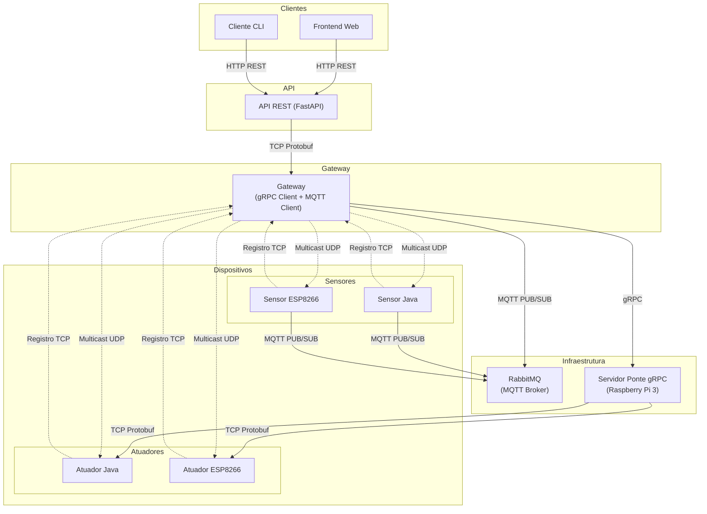

# Smart City - Sistema Distribuído com gRPC e RabbitMQ/MQTT

### Configuração de IPs Hardcoded

Apesar da maior parte do sistema utilizar descoberta automática de IPs e portas via multicast UDP, alguns componentes ainda exigem configuração manual (hardcoded) de IP para funcionamento correto. Veja abaixo:

- **Gateway (src/gateway/smart_city_gateway.py):**
  - Configure o IP do broker MQTT na variável `MQTT_BROKER_HOST`.
    ```python
    MQTT_BROKER_HOST = "192.168.x.x"  # Substitua pelo IP real do seu broker MQTT
    ```
  - Configure o IP do servidor gRPC na variável `GRPC_SERVER_HOST`.
    ```python
    GRPC_SERVER_HOST = "192.168.x.x"  # Substitua pelo IP real do servidor gRPC
    ```

- **Frontend React (src/front-end/smart-city-front/src/App.js e DeviceStatus.js):**
  - O IP do backend (API FastAPI) está hardcoded na variável `IP`.
    ```js
    const IP = '192.168.x.x'
    ```

- **API FastAPI (src/api/src/api_server.py):**
  - O IP do gateway está definido em:
    ```python
    GATEWAY_HOST = "192.168.x.x"
    ```

- **Cliente de Teste (src/client-test/smart_city_client.py e temperature_sensor_commands.py):**
  - O IP do gateway deve ser configurado nas variáveis:
    ```python
    GATEWAY_IP = 'localhost'  # ou '192.168.x.x'
    ```

- **WiFi dos ESP8266:**
  - Configure o SSID e senha da rede WiFi diretamente no código:
    ```cpp
    const char* ssid = "SUA_REDE_WIFI";
    const char* password = "SUA_SENHA_WIFI";
    ```

> **Atenção:** Sempre revise e ajuste esses IPs conforme o ambiente de execução para garantir o funcionamento correto do sistema.

## AVISO IMPORTANTE: Execução em diferentes máquinas

- Comandos de infraestrutura (RabbitMQ, servidor gRPC, setup completo) devem ser executados na Raspberry Pi 3 usando a variável `INFRA=1`.
- Nos demais ambientes (gateway, API, frontend, clientes), execute os comandos normalmente, sem a variável.
- **Plugin gRPC Java**: Necessário apenas na Raspberry Pi 3 para compilação de dispositivos Java com gRPC.

### Exemplos:

**Na Raspberry Pi 3 (Infraestrutura):**
```bash
make setup INFRA=1         # Instala tudo e configura RabbitMQ
make install-grpc-plugin   # Instala plugin gRPC Java automaticamente
make run-grpc INFRA=1      # Executa o servidor ponte gRPC
make rabbitmq INFRA=1      # Configura RabbitMQ
```

**Na máquina de desenvolvimento (Gateway, API, etc):**
```bash
make setup-local                 # Instala dependências, gera protos, compila Java (pula RabbitMQ)
make run-gateway           # Executa o gateway
make run-api               # Executa a API REST
make run-client            # Executa o cliente de teste
```

> Se tentar rodar comandos de infraestrutura sem `INFRA=1` fora da Raspberry Pi, o Makefile exibirá um aviso e não executará o comando.

## Descoberta Automática de Parâmetros de Rede

Os sensores (Java e ESP8266) **não dependem de valores hardcoded** para IP/porta do gateway e do broker MQTT. Todos esses parâmetros são aprendidos automaticamente via o processo de descoberta multicast UDP, enviado pelo gateway.

### Como funciona:
- O gateway envia periodicamente uma mensagem DiscoveryRequest via multicast, contendo:
  - IP e porta TCP do gateway
  - IP e porta do broker MQTT
- Os sensores, ao receberem essa mensagem, aprendem todos os parâmetros necessários para operar e se conectar à infraestrutura.
- Não é necessário editar o código dos sensores para mudar IPs ou portas.

### Parâmetros aprendidos automaticamente:
- IP do gateway
- Porta TCP do gateway
- IP do broker MQTT
- Porta do broker MQTT

> **Atenção:**  
> Certifique-se de que o gateway está enviando a DiscoveryRequest corretamente e que a rede permite multicast UDP.

## Visão Geral

Este projeto implementa um sistema distribuído para simular o monitoramento e controle de uma cidade inteligente, utilizando paradigmas atuais de comunicação distribuída.

### Arquitetura Unificada:

- **Sensores**: Comunicação via **MQTT** (dados e comandos)
- **Atuadores**: Comunicação via **gRPC** através de servidor intermediário
- **Gateway**: Cliente gRPC + Subscriber/Publisher MQTT
- **Descoberta/Registro**: Via UDP multicast e TCP
- **API/Frontend**: Interface REST para controle e monitoramento

### Objetivos:

- Aplicar conceitos avançados de sistemas distribuídos
- Implementar comunicação assíncrona eficiente (MQTT)
- Utilizar RPC síncrono para controle de atuadores (gRPC)
- Garantir descoberta automática de dispositivos
- Prover interface amigável para usuários finais

## Arquitetura do Sistema

A arquitetura foi projetada para ser simples e eficiente, com separação clara de responsabilidades:

### Componentes Principais:

- **Gateway** (`src/gateway/smart_city_gateway.py`):
  - Orquestrador central do sistema
  - **Cliente gRPC** para controlar atuadores
  - **Subscriber/Publisher MQTT** para comunicação com sensores
  - Descoberta multicast e registro TCP de dispositivos
  - Interface entre API REST e infraestrutura distribuída

- **Sensores** (`src/devices/sensors/TemperatureHumiditySensor.java`):
  - Descoberta automática via multicast UDP
  - Registro no gateway via TCP
  - **Comunicação unificada via MQTT** (dados e comandos)
  - Suporte a comandos de configuração em tempo real

- **Atuadores** (`src/devices/actuators/RelayActuator.java`):
  - Descoberta multicast e registro TCP
  - **Controle via gRPC** através de servidor intermediário
  - Resposta com status atualizado

- **Servidor gRPC** (`src/grpc_server/actuator_bridge_server.py`):
  - Ponte entre chamadas gRPC e comunicação TCP
  - Recebe comandos do Gateway via gRPC
  - Traduz para Protocol Buffers TCP para atuadores
  - Gerencia conexões e timeouts

- **RabbitMQ + Plugin MQTT**:
  - Broker MQTT para comunicação assíncrona
  - Tópicos organizados: `smart_city/sensors/+` e `smart_city/commands/sensors/+`
  - Desacoplamento total entre sensores e gateway

- **API REST + Frontend**:
  - Interface de usuário via navegador
  - Cliente CLI para testes e automação
  - Tradução de requisições HTTP para comandos do gateway

## Diagrama da Arquitetura



## Componentes Principais

### 1. **Servidor Ponte gRPC** (`src/grpc_server/actuator_bridge_server.py`)
- Porta 50051
- Recebe chamadas gRPC do Gateway
- Traduz para comandos TCP para atuadores
- Executa na Raspberry Pi 3 como intermediário

### 2. **Gateway** (`src/gateway/smart_city_gateway.py`)
- Cliente gRPC para controlar atuadores
- Cliente MQTT para comunicação com sensores
- Descoberta multicast e registro TCP

### 3. **Sensores** (`src/devices/sensors/TemperatureHumiditySensor.java`)
- Comunicação completa via MQTT (dados e comandos)
- Descoberta multicast e registro TCP
- Suporte a comandos para configuração

### 4. **RabbitMQ + Plugin MQTT**
- Broker MQTT na porta 1883
- Tópicos: `smart_city/sensors/+` e `smart_city/commands/sensors/+`

## Pré-requisitos

> **Atenção:**  
> Use `sudo` apenas para comandos de instalação ou configuração de serviços do sistema (como o RabbitMQ, por exemplo via `make rabbitmq` ou `make setup`).  
> **Ao rodar `make setup` ou `make rabbitmq`, o Makefile pode solicitar sua senha de sudo apenas durante a configuração do RabbitMQ.**  
> **Não utilize sudo para rodar o Makefile inteiro, scripts Python ou comandos de desenvolvimento.**  
> Isso evita problemas de permissões no seu ambiente de trabalho.

- **Python 3.8+** com pip
- **Java 21+** com Maven
- **Protocol Buffers** (protoc)
- **gRPC** (Python e Java)
- **Plugin gRPC Java** (protoc-gen-grpc-java-1.58.0, instalado automaticamente na Raspberry Pi 3)
- **RabbitMQ** com plugin MQTT
- **ESP8266** (NodeMCU) + PlatformIO (opcional)
- **Arduino CLI** (para ESP8266)

## Instalação e Configuração

> **Para um guia detalhado do Makefile com exemplos práticos, consulte [README_MAKEFILE.md](README_MAKEFILE.md)**

### 1. Configuração Automática (Recomendado)

**Na Raspberry Pi 3 (Infraestrutura):**
```bash
# Instala dependências, configura RabbitMQ, gera proto e compila Java
make setup-local INFRA=1
```

**Em máquinas de desenvolvimento:**
```bash
# Instala dependências, gera proto e compila Java (pula RabbitMQ)
make setup-local
```

### 2. Configuração Manual

#### Instalar dependências Python:
```bash
# Criar ambiente virtual
python3 -m venv venv
source venv/bin/activate  # Linux/Mac

# Instalar dependências (inclui gRPC e MQTT)
pip install -r requirements.txt
```

#### Configurar RabbitMQ com plugin MQTT:
```bash
# Automático (apenas na Raspberry Pi 3)
make rabbitmq INFRA=1

# Manual
sudo systemctl start rabbitmq-server
sudo rabbitmq-plugins enable rabbitmq_mqtt
sudo rabbitmq-plugins enable rabbitmq_management
sudo systemctl restart rabbitmq-server
```

#### Instalar plugin gRPC Java (apenas Raspberry Pi 3):
```bash
# Automático (integrado ao setup-local INFRA=1)
make install-grpc-plugin

# Manual
mkdir -p target/protoc-plugins
wget -O target/protoc-plugins/protoc-gen-grpc-java-1.58.0-linux-x86_64.exe \
  https://repo1.maven.org/maven2/io/grpc/protoc-gen-grpc-java/1.58.0/protoc-gen-grpc-java-1.58.0-linux-x86_64.exe
chmod +x target/protoc-plugins/protoc-gen-grpc-java-1.58.0-linux-x86_64.exe
```

#### Gerar código Protocol Buffers e gRPC:
```bash
# Automático
make proto

# Manual
protoc --python_out=src/proto/ src/proto/smart_city.proto
protoc --python_out=src/proto/ --grpc_python_out=src/proto/ src/proto/actuator_service.proto
```

#### Compilar dispositivos Java:
```bash
# Automático
make java

# Manual
mvn clean package
```

### 3. Configurar ESP8266 para MQTT (Opcional)
```bash
cd esp8266-projects/temperature-sensor-board
# Seguir instruções em MQTT_COMMANDS_GUIDE.md
```

## Execução do Sistema

> **Para comandos detalhados e exemplos práticos, consulte [README_MAKEFILE.md](README_MAKEFILE.md)**

### Arquitetura de Execução

**Infraestrutura (Raspberry Pi 3):**
- RabbitMQ MQTT Broker
- Servidor gRPC
- Gateway (pode rodar em qualquer máquina)

**Dispositivos (Qualquer máquina):**
- Sensores Java (MQTT)
- Atuadores Java (gRPC)
- ESP8266 (MQTT)
- Clientes de teste

### Pré-requisitos
- RabbitMQ instalado e em execução na Raspberry Pi 3
- Plugin MQTT habilitado no RabbitMQ
- Java 17+ instalado
- Python 3.10+ com ambiente virtual configurado

### Execução Rápida

#### Na Raspberry Pi 3 (Infraestrutura)
```bash
# Terminal 1: Servidor gRPC
make run-grpc INFRA=1

# Terminal 2: Testes
make test-mqtt INFRA=1
make validate-v3 INFRA=1
```

#### Em Qualquer Máquina (Dispositivos)
```bash
# Terminal 1: Gateway
make run-gateway

# Terminal 2: Sensor
make run-sensor

# Terminal 3: Atuador
make run-actuator

# Terminal 4: Cliente de teste
make run-client
```

### Execução Detalhada (Método Tradicional)

#### 1. Servidor gRPC (Terminal 1) - OBRIGATÓRIO PRIMEIRO
```bash
# Na Raspberry Pi 3
make run-grpc INFRA=1
```
Status: Servidor rodando na porta 50051

#### 2. Gateway (Terminal 2)
```bash
# Em qualquer máquina
make run-gateway
```
Status: Gateway conectado ao broker MQTT e servidor gRPC

#### 3. Sensor Java (Terminal 3)
```bash
# Em qualquer máquina
make run-sensor
```
Status: Sensor publicando dados via MQTT

#### 4. Atuador Java (Terminal 4)
```bash
# Em qualquer máquina
make run-actuator
```
Status: Atuador aguardando comandos gRPC

#### 5. Cliente de Teste (Terminal 5)
```bash
# Em qualquer máquina
make run-client
```
Status: Cliente pronto para enviar comandos
```bash
source venv/bin/activate
make run-client
```
Status: Cliente conectado ao gateway via TCP

### Componentes Opcionais

#### API REST (Terminal 5)
```bash
make run-api
```
Acesso: http://localhost:8000/docs

#### Frontend Web (Terminal 6)
```bash
cd src/front-end/smart-city-front
npm install
npm start
```
Acesso: http://localhost:3000

### Verificação do Sistema

#### Testes de Conectividade
```bash
# Status geral
make status

# Teste completo do sistema
python3 validate_system.py

# Monitorar MQTT
mosquitto_sub -h localhost -t "smart_city/sensors/+" -v
```

#### Testes de Funcionalidade
```bash
# Publicar dados de teste
mosquitto_pub -h localhost -t "smart_city/sensors/test" -m '{"device_id":"test","temperature":25.0}'

# Verificar logs do gateway
tail -f gateway.log
```

## Fluxo de Comunicação

### 1. **Descoberta e Registro**
- Gateway envia `DiscoveryRequest` via UDP multicast
- Dispositivos escutam no grupo `224.1.1.1:5007`
- Dispositivos se registram via TCP enviando `DeviceInfo`
- Registro periódico a cada 30 segundos para tolerância a falhas

### 2. **Comunicação com Sensores** (MQTT)
- Sensores publicam dados via MQTT: `smart_city/sensors/{device_id}`
- Sensores recebem comandos via MQTT: `smart_city/commands/sensors/{device_id}`
- Sensores enviam respostas via MQTT: `smart_city/commands/sensors/{device_id}/response`
- RabbitMQ broker gerencia toda a comunicação assíncrona
- Gateway subscreve/publica nos tópicos apropriados
- Formato: JSON estruturado

### 3. **Controle de Atuadores** (gRPC)
- Cliente/API → Gateway → Servidor Ponte gRPC → Atuador TCP
- Gateway faz chamada gRPC: `LigarDispositivo()`, `DesligarDispositivo()`
- Servidor ponte gRPC traduz para comando TCP Protocol Buffers
- Atuador responde com `DeviceUpdate` via TCP

### 4. **Tolerância a Falhas**
- Reconexão automática MQTT
- Retry automático gRPC
- Registro periódico TCP mantido
- Timeouts configuráveis

Este modelo permite comunicação **assíncrona** para sensores e **síncrona** para atuadores, otimizando performance e confiabilidade.

## Comunicação e Serialização

Para garantir interoperabilidade e eficiência na arquitetura unificada:

### **Protocol Buffers**
- `smart_city.proto`: Mensagens básicas (DeviceInfo, DeviceUpdate, etc.)
- `actuator_service.proto`: Serviços gRPC para atuadores
- Envelope `SmartCityMessage` para compatibilidade TCP

### **gRPC (HTTP/2)**
- Comunicação Gateway ↔ Servidor Ponte gRPC
- Chamadas síncronas para controle de atuadores
- Suporte a streaming e multiplexação

### **MQTT (TCP)**
- Comunicação Sensores → RabbitMQ → Gateway
- QoS configurável (0, 1, 2)
- Tópicos hierárquicos organizados

### **TCP/UDP (Descoberta)**
- Descoberta multicast UDP mantida
- Registro TCP mantido para compatibilidade

## Protocolo de Comunicação (.proto)

### Arquivo `smart_city.proto` (Mantido)
Usado para comunicação TCP/UDP com dispositivos:

```protobuf
message SmartCityMessage {
  MessageType message_type = 1;
  oneof payload {
    ClientRequest client_request = 2;
    DeviceUpdate device_update = 3;
    GatewayResponse gateway_response = 4;
    DeviceInfo device_info = 5;
    DiscoveryRequest discovery_request = 6;
  }
}
```

### Arquivo `actuator_service.proto` (Novo)
Usado para comunicação gRPC:

```protobuf
service AtuadorService {
  rpc LigarDispositivo(DeviceRequest) returns (StatusResponse);
  rpc DesligarDispositivo(DeviceRequest) returns (StatusResponse);
  rpc ConsultarEstado(DeviceRequest) returns (StatusResponse);
}

message DeviceRequest {
  string device_id = 1;
  string ip = 2;
  int32 port = 3;
}

message StatusResponse {
  string status = 1;
  string message = 2;
}
```

### Tópicos MQTT
- `smart_city/sensors/{device_id}`: Dados individuais de sensor
- Payload JSON:
```json
{
  "device_id": "temp_board_001001004",
  "temperature": 25.5,
  "humidity": 60.2,
  "status": "ACTIVE",
  "timestamp": 1234567890,
  "frequency_ms": 5000
}
```

## Tabela de Comandos

### Atuadores (via gRPC)
| Dispositivo | Ação | Método gRPC | Parâmetros |
|------------|------|-------------|------------|
| Relé/Atuador | Ligar | `LigarDispositivo()` | `DeviceRequest{device_id, ip, port}` |
| Relé/Atuador | Desligar | `DesligarDispositivo()` | `DeviceRequest{device_id, ip, port}` |
| Relé/Atuador | Consultar | `ConsultarEstado()` | `DeviceRequest{device_id, ip, port}` |

### Comandos MQTT para Sensores

### Estrutura de Tópicos MQTT

#### Dados de Sensores
```
smart_city/sensors/{device_id}
```

#### Comandos para Sensores
```
smart_city/commands/sensors/{device_id}
```

#### Respostas de Comandos
```
smart_city/commands/sensors/{device_id}/response
```

### Formato de Comando JSON
```json
{
  "command_type": "TURN_ON",
  "command_value": "",
  "request_id": "unique_request_id",
  "timestamp": 1640995200000
}
```

### Formato de Resposta JSON
```json
{
  "device_id": "temp_sensor_001",
  "request_id": "unique_request_id",
  "success": true,
  "message": "Sensor activated",
  "status": "ACTIVE",
  "frequency_ms": 5000,
  "temperature": 25.3,
  "humidity": 60.2,
  "timestamp": 1640995200000
}
```

### Comandos Suportados
- `TURN_ON`/`TURN_ACTIVE`: Ativa o sensor
- `TURN_OFF`/`TURN_IDLE`: Coloca o sensor em modo idle
- `SET_FREQ`: Altera frequência de coleta (valor em ms)
- `GET_STATUS`: Consulta status atual

## Detalhamento dos Tópicos MQTT

### **Tópicos de Dados (Publicação pelos Sensores)**

#### Padrão: `smart_city/sensors/{device_id}`

**Exemplos de Tópicos:**
```
smart_city/sensors/temp_sensor_001
smart_city/sensors/temp_sensor_esp_001
smart_city/sensors/humidity_sensor_002
```

**Formato da Mensagem:**
```json
{
  "device_id": "temp_sensor_esp_001",
  "temperature": 25.3,
  "humidity": 60.2,
  "status": "ACTIVE",
  "timestamp": 1640995200000,
  "version": "mqtt"
}
```

### **Tópicos de Comandos (Publicação pelo Gateway)**

#### Padrão: `smart_city/commands/sensors/{device_id}`

**Exemplos de Tópicos:**
```
smart_city/commands/sensors/temp_sensor_001
smart_city/commands/sensors/temp_sensor_esp_001
smart_city/commands/sensors/humidity_sensor_002
```

**Formato da Mensagem:**
```json
{
  "command_type": "SET_FREQ",
  "command_value": "3000",
  "request_id": "cmd_1640995200_001",
  "timestamp": 1640995200000
}
```

### **Tópicos de Resposta (Publicação pelos Sensores)**

#### Padrão: `smart_city/commands/sensors/{device_id}/response`

**Exemplos de Tópicos:**
```
smart_city/commands/sensors/temp_sensor_001/response
smart_city/commands/sensors/temp_sensor_esp_001/response
smart_city/commands/sensors/humidity_sensor_002/response
```

**Formato da Mensagem:**
```json
{
  "device_id": "temp_sensor_esp_001",
  "request_id": "cmd_1640995200_001",
  "success": true,
  "message": "Frequência alterada para 3000ms",
  "status": "ACTIVE",
  "frequency_ms": 3000,
  "timestamp": 1640995200001
}
```

### **Comandos para Monitoramento**

#### Monitorar Todos os Sensores:
```bash
# Dados de todos os sensores
mosquitto_sub -h localhost -t "smart_city/sensors/+" -v

# Comandos para todos os sensores
mosquitto_sub -h localhost -t "smart_city/commands/sensors/+" -v

# Respostas de todos os sensores
mosquitto_sub -h localhost -t "smart_city/commands/sensors/+/response" -v
```

#### Monitorar Sensor Específico:
```bash
# Dados do sensor ESP8266
mosquitto_sub -h localhost -t "smart_city/sensors/temp_sensor_esp_001" -v

# Comandos para sensor ESP8266
mosquitto_sub -h localhost -t "smart_city/commands/sensors/temp_sensor_esp_001" -v

# Respostas do sensor ESP8266
mosquitto_sub -h localhost -t "smart_city/commands/sensors/temp_sensor_esp_001/response" -v
```

#### Enviar Comandos Manualmente:
```bash
# Ativar sensor
mosquitto_pub -h localhost -t "smart_city/commands/sensors/temp_sensor_esp_001" \
  -m '{"command_type":"TURN_ON","request_id":"manual_001","timestamp":1640995200000}'

# Alterar frequência para 2 segundos
mosquitto_pub -h localhost -t "smart_city/commands/sensors/temp_sensor_esp_001" \
  -m '{"command_type":"SET_FREQ","command_value":"2000","request_id":"manual_002","timestamp":1640995200000}'

# Consultar status
mosquitto_pub -h localhost -t "smart_city/commands/sensors/temp_sensor_esp_001" \
  -m '{"command_type":"GET_STATUS","request_id":"manual_003","timestamp":1640995200000}'
```

### **Configuração de QoS**

- **Dados de Sensores**: QoS 0 (fire-and-forget, dados periódicos)
- **Comandos**: QoS 1 (at-least-once, garantir entrega)
- **Respostas**: QoS 1 (at-least-once, confirmar processamento)

### **Estrutura de Payload por Tipo de Comando**

#### Comando `SET_FREQ` - Resposta contém apenas frequência:
```json
{
  "device_id": "temp_sensor_esp_001",
  "request_id": "cmd_freq_001",
  "success": true,
  "message": "Frequência alterada para 3000ms",
  "status": "ACTIVE",
  "frequency_ms": 3000,
  "timestamp": 1640995200001
}
```

#### Outros Comandos - Resposta contém dados do sensor:
```json
{
  "device_id": "temp_sensor_esp_001",
  "request_id": "cmd_status_001",
  "success": true,
  "message": "Status atual: ACTIVE",
  "status": "ACTIVE",
  "temperature": 25.3,
  "humidity": 60.2,
  "timestamp": 1640995200001
}
```

### Implementação no Gateway

O Gateway detecta automaticamente se um sensor suporta comandos MQTT através do campo `capabilities`:

```python
# Detecção automática de sensor MQTT
is_mqtt_sensor = device_info.capabilities.get("communication") == "mqtt"

if is_mqtt_sensor:
    # Enviar comando via MQTT
    response = send_mqtt_command(device_id, command_type, command_value)
else:
    # Fallback para compatibilidade
    response = send_tcp_command(device_id, command_type, command_value)
```

### Vantagens da Comunicação MQTT

1. **Comunicação Unificada**: Todos os dados dos sensores via MQTT
2. **Confiabilidade**: QoS 1 garante entrega de comandos
3. **Escalabilidade**: Fácil adição de novos sensores
4. **Monitoramento**: Gateway pode rastrear respostas
5. **Assíncrono**: Processamento não-bloqueante
6. **ESP8266 Friendly**: Suporte nativo MQTT, baixo consumo de memória

### Compatibilidade
O Gateway mantém compatibilidade com:
- Sensores (comandos MQTT)
- Atuadores (comandos gRPC)

### Arquitetura da Comunicação


### Teste de Comandos MQTT

#### Para Sensores Java:
```bash
python3 test_mqtt_commands.py
```

#### Para Sensores ESP8266:
```bash
python3 test_esp8266_mqtt_commands.py temp_sensor_esp_001
```

#### Testes manuais com mosquitto:
```bash
# Ativar sensor ESP8266
mosquitto_pub -h 192.168.3.129 -t "smart_city/commands/sensors/temp_sensor_esp_001" \
  -m '{"command_type":"TURN_ON","request_id":"test123","timestamp":1640995200000}'

# Alterar frequência
mosquitto_pub -h 192.168.3.129 -t "smart_city/commands/sensors/temp_sensor_esp_001" \
  -m '{"command_type":"SET_FREQ","command_value":"3000","request_id":"test124","timestamp":1640995200000}'

# Monitorar respostas
mosquitto_sub -h 192.168.3.129 -t "smart_city/commands/sensors/+/response"
```

#### Implementação ESP8266

#### Código Completo Disponível:
```
esp8266-projects/temperature-sensor-board/temperature-sensor-board.ino
```

#### Bibliotecas Necessárias:
- `PubSubClient` (MQTT)
- `ArduinoJson` (parsing JSON)
- `ESP8266WiFi` (conectividade)
- `DHT sensor library` (sensor de temperatura)

#### Configuração Hardware:
```
ESP8266 (NodeMCU)    DHT11
==================   =====
3.3V                 VCC
GND                  GND
D3                   DATA
```

#### Configuração Software:
```cpp
const char* ssid = "YOUR_WIFI_SSID";
const char* password = "YOUR_WIFI_PASSWORD";
const char* mqtt_server = "192.168.3.129";
const char* device_id = "temp_sensor_esp_001";
```

## Controle de Atuadores (gRPC)

O controle de atuadores é realizado via gRPC entre o Gateway e o Servidor Ponte gRPC. O Gateway envia comandos contendo o ID, IP e porta do dispositivo, permitindo que o servidor gRPC se conecte diretamente ao atuador.

Exemplo de mensagem gRPC:
```proto
message DeviceId {
  string device_id = 1;
  string ip = 2;
  int32 port = 3;
}
```

## Desenvolvimento e Contribuição

### Estrutura do Projeto
```
Trabalho-SD-RabbitMQ-MQTT-gRPC/
├── src/
│   ├── gateway/           # Gateway principal (Python)
│   ├── grpc_server/       # Servidor gRPC (Python)
│   ├── devices/           # Dispositivos IoT (Java)
│   ├── client-test/       # Cliente de teste (Python)
│   ├── api/              # API REST (FastAPI)
│   └── proto/            # Definições Protocol Buffers
├── esp8266-projects/      # Projetos ESP8266
├── target/               # Arquivos compilados Java
├── venv/                 # Ambiente virtual Python
├── Makefile              # Automação de build
└── README.md             # Este arquivo
```

### Tecnologias Utilizadas

**Backend:**
- **Python 3.10+**: Gateway, servidor gRPC, APIs
- **Java 17+**: Dispositivos IoT simulados
- **Protocol Buffers**: Serialização de dados
- **gRPC**: Comunicação com atuadores
- **MQTT**: Comunicação com sensores

**Infraestrutura:**
- **RabbitMQ**: Broker MQTT
- **Maven**: Build Java
- **FastAPI**: API REST

**Hardware:**
- **ESP8266**: Dispositivos IoT reais
- **Raspberry Pi**: Servidor gRPC dedicado

### Adicionando Novos Dispositivos

#### Novo Sensor (MQTT)
```java
// 1. Criar classe em src/devices/sensors/
public class NovoSensor {
    // Implementar comunicação MQTT
    // Usar padrão do TemperatureHumiditySensor
}

// 2. Adicionar ao Makefile
run-novo-sensor:
    java -jar target/novo-sensor.jar
```

#### Novo Atuador (gRPC)
```java
// 1. Criar classe em src/devices/actuators/
public class NovoAtuador {
    // Implementar servidor TCP para comandos gRPC
    // Usar padrão do RelayActuator
}

// 2. Adicionar ao servidor gRPC
// src/grpc_server/actuator_bridge_server.py
```

### Extensões Possíveis

1. **Interface Web**: Frontend React/Vue.js
2. **Banco de Dados**: PostgreSQL para histórico
3. **Alertas**: Sistema de notificações
4. **Dashboard**: Grafana para visualização
5. **Autenticação**: JWT para segurança
6. **Docker**: Containerização do sistema

### Debugging e Logs

```bash
# Logs detalhados do Gateway
export PYTHONPATH=$PYTHONPATH:$(pwd)
python3 -c "
import logging
logging.basicConfig(level=logging.DEBUG)
"

# Logs do RabbitMQ
sudo journalctl -u rabbitmq-server -f

# Monitoramento MQTT
mosquitto_sub -h localhost -t "smart_city/+/+" -v
```

### Contribuindo para o Projeto

1. **Fork** o repositório
2. **Crie uma branch** para sua feature
3. **Implemente** seguindo os padrões existentes
4. **Teste** com `make status` e `python3 test_full_system.py`
5. **Submeta** um Pull Request

### Padrões de Código

**Python:**
- PEP 8 compliance
- Type hints quando possível
- Docstrings em funções públicas

**Java:**
- Google Java Style Guide
- Logging adequado
- Tratamento de exceções

**Protocol Buffers:**
- Comentários descritivos
- Versionamento adequado
- Campos opcionais quando apropriado

## Referências e Recursos

### Documentação Oficial
- [gRPC Python](https://grpc.io/docs/languages/python/)
- [Protocol Buffers](https://developers.google.com/protocol-buffers)
- [RabbitMQ MQTT](https://www.rabbitmq.com/mqtt.html)
- [Paho MQTT](https://www.eclipse.org/paho/clients/python/)

### Artigos e Tutoriais
- [MQTT vs gRPC: Quando usar cada um](https://example.com)
- [Sistemas Distribuídos com Python](https://example.com)
- [IoT com ESP8266 e MQTT](https://example.com)

### Ferramentas Úteis
- **MQTT Explorer**: GUI para debug MQTT
- **Postman**: Teste de APIs REST
- **Wireshark**: Análise de tráfego de rede
- **Docker Compose**: Orquestração de serviços


## Autor

Desenvolvido como parte do curso de Sistemas Distribuídos.

**Data**: Julho 2025  
**Versão**: 2.0 (Arquitetura Unificada MQTT + gRPC)

---

Para suporte ou dúvidas, consulte a seção de **Troubleshooting** ou abra uma issue no repositório.

### Troubleshooting

#### Problema: RabbitMQ não está rodando
```bash
# Verificar status
sudo systemctl status rabbitmq-server

# Reiniciar se necessário
sudo systemctl restart rabbitmq-server

# Verificar logs
sudo journalctl -u rabbitmq-server -f
```

#### Problema: Plugin MQTT não habilitado
```bash
# Habilitar plugin MQTT
sudo rabbitmq-plugins enable rabbitmq_mqtt

# Verificar plugins habilitados
sudo rabbitmq-plugins list | grep mqtt
```

#### Problema: Servidor gRPC não conecta
```bash
# Verificar porta 50051
ss -tulpn | grep 50051

# Testar conexão gRPC
python3 -c "
import grpc
from src.proto import actuator_service_pb2_grpc
channel = grpc.insecure_channel('localhost:50051')
stub = actuator_service_pb2_grpc.AtuadorServiceStub(channel)
print('Conexão gRPC OK')
"
```

#### Problema: Gateway não conecta ao MQTT
```bash
# Verificar conectividade MQTT
mosquitto_sub -h localhost -t "test" -v &
mosquitto_pub -h localhost -t "test" -m "teste"

# Verificar configuração do broker
sudo rabbitmqctl status
```

#### Problema: Dispositivos Java não iniciam
```bash
# Verificar se plugin gRPC Java está instalado (apenas Raspberry Pi 3)
make install-grpc-plugin

# Verificar compilação
make java

# Verificar dependências
mvn dependency:tree

# Executar com logs detalhados
java -jar target/temperature-humidity-sensor.jar -Djava.util.logging.config.file=logging.properties
```

#### Problema: Erro de compilação Protocol Buffers
```bash
# Instalar plugin gRPC Java (apenas na Raspberry Pi 3)
make install-grpc-plugin

# Regenerar arquivos proto
make proto

# Compilar novamente
make java
```

### Configuração Avançada

#### Configuração de Rede
```bash
# Para executar em rede local, altere IPs nos arquivos:
# src/gateway/smart_city_gateway.py - BROKER_HOST
# src/devices/sensors/TemperatureHumiditySensor.java - GATEWAY_HOST
# src/devices/actuators/RelayActuator.java - GATEWAY_HOST
```

#### Configuração do RabbitMQ
```bash
# Arquivo de configuração: /etc/rabbitmq/rabbitmq.conf
# Adicionar configurações MQTT customizadas:

# Porta MQTT (padrão: 1883)
mqtt.default_port = 1883

# Timeout de conexão
mqtt.connection_timeout = 30000

# Tamanho máximo da mensagem
mqtt.max_message_size = 1024
```

#### Configuração de Logs
```bash
# Python - configurar logging detalhado
export PYTHONPATH=$PYTHONPATH:$(pwd)
export LOGLEVEL=DEBUG

# Java - configurar logging
java -Djava.util.logging.config.file=logging.properties -jar target/sensor.jar
```

### Exemplos de Uso

#### Comando de Sensor via MQTT
```bash
# Ativar sensor
mosquitto_pub -h localhost -t "smart_city/commands/sensors/temp_sensor_001" \
  -m '{"command_type":"TURN_ON","request_id":"123","timestamp":1640995200000}'

# Alterar frequência
mosquitto_pub -h localhost -t "smart_city/commands/sensors/temp_sensor_001" \
  -m '{"command_type":"SET_FREQ","command_value":"3000","request_id":"124","timestamp":1640995200000}'

# Consultar status
mosquitto_pub -h localhost -t "smart_city/commands/sensors/temp_sensor_001" \
  -m '{"command_type":"GET_STATUS","request_id":"125","timestamp":1640995200000}'
```

#### Comando de Atuador via gRPC
```bash
# Testar comando via grpcurl
grpcurl -plaintext -d '{"device_id":"relay_001","ip":"localhost","port":8080}' \
  localhost:50051 actuator_service.AtuadorService/LigarDispositivo
```

#### Monitoramento em Tempo Real
```bash
# Terminal 1: Monitorar dados dos sensores
mosquitto_sub -h localhost -t "smart_city/sensors/+" -v

# Terminal 2: Monitorar comandos
mosquitto_sub -h localhost -t "smart_city/commands/sensors/+" -v

# Terminal 3: Monitorar respostas
mosquitto_sub -h localhost -t "smart_city/commands/sensors/+/response" -v
```

### Comandos Especiais

#### make demo
Executa uma demonstração completa do sistema, iniciando todos os principais componentes em background e realizando testes automáticos de comandos MQTT.

#### make test-esp8266-mqtt
Executa testes automáticos de comandos MQTT específicos para sensores ESP8266, simulando comandos e verificando respostas.

## Automatização com Makefile

O projeto inclui um Makefile completo para automatizar todas as tarefas de compilação, execução e teste. 

### Comandos Principais

```bash
# Ver todos os comandos disponíveis
make help

# Configuração completa
make setup-local

# Executar na Raspberry Pi 3
make run-grpc INFRA=1
make validate-v3 INFRA=1

# Executar dispositivos
make run-gateway
make run-sensor
make run-actuator
make run-client
```

### Documentação Completa

Para uma lista completa de comandos, exemplos práticos e guias de solução de problemas, consulte:

**[README_MAKEFILE.md](README_MAKEFILE.md) - Guia Completo do Makefile**

Este documento inclui:
- Todos os comandos disponíveis
- Exemplos práticos de uso
- Fluxos de trabalho completos
- Solução de problemas
- Configuração de variáveis
