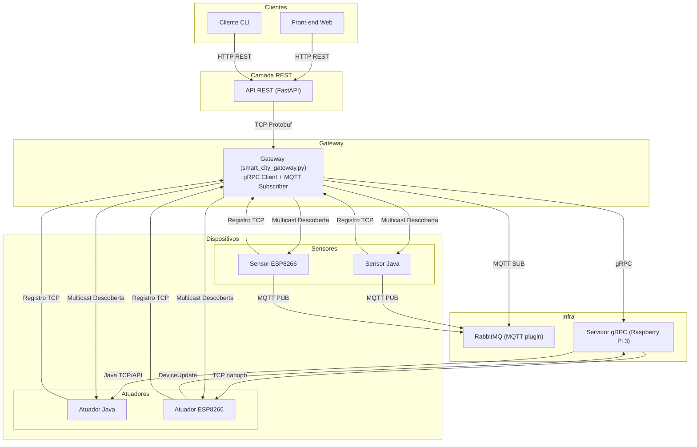

# Trabalho 2 – Sistemas Distribuídos  
## Arquitetura com gRPC e RabbitMQ

Este documento descreve as mudanças necessárias para adaptar o projeto do Trabalho 1 (baseado em sockets TCP/UDP e Protocol Buffers) aos requisitos do Trabalho 2, que envolve o uso de gRPC para comandos e RabbitMQ (via MQTT) para envio de dados sensoriados. A nova arquitetura preserva os dispositivos reais (ESP8266), os simuladores em Java, a API REST com FastAPI e o cliente CLI, reorganizando-os de acordo com os novos paradigmas exigidos.

## 1. Gateway Inteligente

O gateway, antes responsável por gerenciar a comunicação com os dispositivos via TCP e UDP, passa a operar como cliente gRPC, invocando métodos remotos para controlar os atuadores. A comunicação direta com os atuadores ESP8266 por TCP é substituída por chamadas gRPC feitas a um servidor intermediário executado em uma Raspberry Pi 3. Além disso, o gateway também se conecta ao RabbitMQ como consumidor MQTT, recebendo dados dos sensores de forma assíncrona.

A API REST já existente (implementada com FastAPI) continua sendo utilizada, servindo como a interface de entrada para o cliente CLI e o front-end web. Ela se comunica exclusivamente com o gateway, encaminhando as requisições REST para que o próprio gateway realize as chamadas gRPC aos atuadores ou processe os dados recebidos dos sensores via broker. Dessa forma, o gateway mantém sua função de orquestrador central do sistema distribuído, sendo o único ponto de contato com o servidor gRPC e com o RabbitMQ.

## 2. Dispositivos Reais (ESP8266)

Os atuadores físicos não sofrem alteração no firmware. Os atuadores continuam escutando comandos via TCP, enquanto os sensores passam a publicar mensagens periódicas via MQTT para o broker RabbitMQ. A descoberta via multicast UDP e o registro no gateway ainda são realizados via TCP com mensagens Protobuf serializadas com nanopb.

A diferença principal é que, no novo modelo, o gateway não se comunica mais diretamente com os ESPs. O envio de comandos é intermediado por uma Raspberry Pi, que atua como servidor gRPC e tradutor para TCP. Já o envio de dados sensoriados agora ocorre de forma indireta por tópicos MQTT.

## 3. Servidor gRPC na Raspberry Pi 3

A Raspberry Pi 3 executa um servidor gRPC responsável por receber chamadas do gateway e repassar os comandos TCP para os atuadores ESP8266 ou os simulados em Java. Essa camada serve como ponte entre o ambiente gRPC (HTTP/2) e os dispositivos finais, operando como um orquestrador de comandos. Ao receber uma requisição, o servidor gRPC estabelece uma conexão com o atuador apropriado, envia o comando e retorna a resposta ao gateway.

## 4. Dispositivos Simulados (Java)

Os dispositivos simulados em Java continuam sendo utilizados e agora devem seguir o mesmo comportamento dos dispositivos reais. Isso significa que sensores e atuadores Java também participam da descoberta por multicast UDP, escutando o endereço do gateway e registrando-se automaticamente por TCP. Os sensores Java passam a publicar suas leituras via MQTT no broker RabbitMQ, enquanto os atuadores Java passam a receber comandos por meio do servidor gRPC da Raspberry Pi, com repasse via TCP ou chamada local. Essa uniformização entre dispositivos reais e simulados simplifica o gerenciamento e padroniza a comunicação entre todos os componentes do sistema.

## 5. Cliente de Controle (CLI)

O cliente de linha de comando `smart_city_client.py` continua funcionando como ferramenta de testes, mas agora se comunica exclusivamente com a API REST do gateway. Ao invés de abrir sockets TCP, ele envia requisições HTTP para listar dispositivos, consultar status e enviar comandos. A lógica de menu e interação permanece praticamente inalterada.

## 6. Organização dos Arquivos .proto

Para manter clareza e modularidade, opta-se por manter o arquivo `smart_city.proto` com as definições de mensagens para comunicação via TCP/UDP (usadas por ESP8266 e simuladores Java). Já a definição dos serviços gRPC fica em um arquivo separado chamado `actuator_service.proto`. Essa separação evita conflitos, facilita a manutenção e respeita as restrições de ambientes embarcados que utilizam nanopb.

###  actuator_service.proto:

```proto
syntax = "proto3";

package actuator;

service AtuadorService {
  rpc LigarDispositivo(DeviceRequest) returns (StatusResponse);
  rpc DesligarDispositivo(DeviceRequest) returns (StatusResponse);
  rpc ConsultarEstado(DeviceRequest) returns (StatusResponse);
}

message DeviceRequest {
  string device_id = 1;
  string ip = 2;
  int32 port = 3;
}

message StatusResponse {
  string status = 1;
  string message = 2;
}
```

## 7. Conclusão

Com essa reorganização, o sistema distribuído se alinha aos requisitos de comunicação e integração exigidos no Trabalho 2. A comunicação com sensores passa a ser assíncrona e desacoplada por meio do RabbitMQ, enquanto os comandos para atuadores utilizam gRPC como mecanismo de invocação remota. As adaptações preservam o esforço já investido no Trabalho 1, reaproveitando componentes essenciais como o firmware dos ESPs, a API REST e os simuladores em Java.

## Diagrama da Nova Arquitetura

