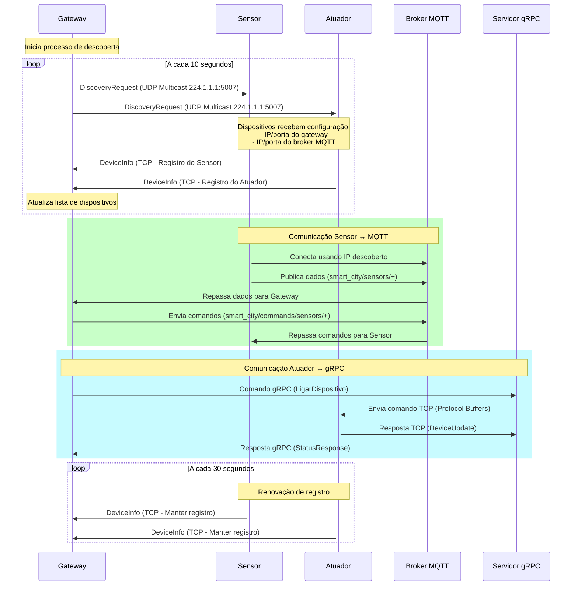

# Lógica de Descoberta – Smart City IoT

Este documento explica como funciona o protocolo de descoberta automática entre o **gateway**, **sensores** e **atuadores** no sistema Smart City, detalhando o fluxo de mensagens, exemplos e o protocolo utilizado, conforme o código real dos dispositivos e gateway.

---

## 1. Visão Geral

A descoberta automática permite que sensores e atuadores encontrem o gateway na rede sem configuração manual de IPs. O processo envolve:
- **Gateway** anunciando sua presença via multicast UDP (mensagem DiscoveryRequest, incluindo IP, portas e dados do broker MQTT).
- **Dispositivos** (sensores/atuadores) escutando esse anúncio, aprendendo IP/portas do gateway e do broker MQTT.
- **Sensores**: registram-se via TCP, comunicam dados e comandos via MQTT.
- **Atuadores**: registram-se via TCP, comunicam comandos e status via TCP.

---

## 2. Fluxo de Comunicação



---


## 3. Passo a Passo da Descoberta

### 1. Gateway anuncia sua presença
- Envia periodicamente `DiscoveryRequest` via UDP multicast para 224.1.1.1:5007, encapsulada em SmartCityMessage.
- Mensagem contém IP, portas do gateway e dados do broker MQTT.

### 2. Dispositivo escuta e descobre o gateway
- Escuta a porta multicast.
- Ao receber `DiscoveryRequest`, aprende IP/portas do gateway e do broker MQTT.

### 3. Dispositivo registra-se no gateway
- Envia `DeviceInfo` via TCP para o gateway.
- Gateway adiciona o dispositivo à lista de conectados.

### 4. Sensor envia dados via MQTT
- Envia dados sensoriados periodicamente via MQTT (`dataTopic`).
- Recebe comandos via MQTT (`commandTopic`).
- Envia respostas via MQTT (`responseTopic`).

### 5. Atuador envia status via TCP
- Envia `DeviceUpdate` via TCP para o gateway.
- Recebe comandos via TCP.

---


## 4. Mensagens Utilizadas (smart_city.proto)


### DiscoveryRequest (descoberta)
Enviada pelo gateway via UDP multicast para todos na rede.

```protobuf
message DiscoveryRequest {
  string gateway_ip = 1;
  int32 gateway_tcp_port = 2;
  int32 gateway_udp_port = 3;
  string mqtt_broker_ip = 4;
  int32 mqtt_broker_port = 5;
}
```

- **Protocolo:** UDP multicast
- **Endereço:** 224.1.1.1:5007
- **Envelope:** Encapsulada em SmartCityMessage


### DeviceInfo (registro)
Enviada pelo dispositivo para o gateway via TCP após receber o DiscoveryRequest.

```protobuf
message DeviceInfo {
  string device_id = 1;
  DeviceType type = 2;
  string ip_address = 3;
  int32 port = 4;
  DeviceStatus initial_state = 5;
  bool is_actuator = 6;
  bool is_sensor = 7;
}
```

- **Protocolo:** TCP
- **Envelope:** Encapsulada em SmartCityMessage


### DeviceUpdate (status)
Enviada periodicamente pelo atuador relay via TCP, informando apenas status ON/OFF.

```protobuf
message DeviceUpdate {
  string device_id = 1;
  DeviceType type = 2;
  DeviceStatus current_status = 3; // ON ou OFF
}
```

- **Protocolo:** TCP (atuadores)
- **Envelope:** Encapsulada em SmartCityMessage

### Dados do Sensor (MQTT)
Enviados periodicamente pelo sensor via MQTT:
```json
{
  "device_id": "temp_sensor_esp_002",
  "temperature": 23.5,
  "humidity": 60.0,
  "status": "ACTIVE",
  "timestamp": 123456789,
  "version": "mqtt_real",
  "data_source": "dht11"
}
```

---


## 5. Comandos para Atuadores

Os atuadores ESP8266 não executam um servidor gRPC diretamente. Em vez disso, o fluxo de comandos é:
- O gateway envia comandos gRPC para o servidor intermediário `actuator_bridge_server.py` (executando na Raspberry Pi).
- O `actuator_bridge_server.py` recebe o comando gRPC, traduz para mensagem Protocol Buffers e encaminha via TCP para o atuador ESP.
- O atuador executa o comando recebido via TCP/Protocol Buffers e responde com DeviceUpdate via TCP.

---


## 6. Comandos para Sensores

Além de enviar dados periodicamente via MQTT, **sensores também podem receber comandos do gateway** via MQTT (`commandTopic`). Os principais comandos são:

- **Alterar frequência de atualização:**
  - O gateway pode enviar um comando MQTT para o sensor mudar o intervalo de envio dos dados sensoriados (por exemplo, de 5s para 60s).
  - O sensor ajusta seu temporizador interno conforme o valor recebido.

- **Alterar estado (ex: IDLE/ACTIVE):**
  - O gateway pode colocar o sensor em modo `IDLE` via comando MQTT.
  - **Quando em IDLE, o sensor pausa o envio de dados sensoriados** (não publica mais no tópico de dados até voltar para ACTIVE).

Esses comandos são importantes para economia de energia, controle dinâmico da rede e gerenciamento remoto dos dispositivos.

---


## 7. Observações
- O uso do envelope `SmartCityMessage` é padrão para todas as mensagens TCP/UDP, inclusive DiscoveryRequest.
- Sensores comunicam dados e comandos exclusivamente via MQTT após registro.
- O gateway só considera dispositivos "ativos" se eles enviarem status/dados periodicamente.
- O filtro de tempo para considerar um dispositivo "ligado" pode ser ajustado no gateway.

---


## 8. Exemplo de Mensagens

### DiscoveryRequest (enviada pelo gateway)
```json
{
  "gateway_ip": "192.168.0.10",
  "gateway_tcp_port": 12345,
  "gateway_udp_port": 12346,
  "mqtt_broker_ip": "192.168.0.10",
  "mqtt_broker_port": 1883
}
```

### DeviceInfo (enviada pelo sensor/atuador)
```json
{
  "device_id": "temp_sensor_esp_002",
  "type": "TEMPERATURE_SENSOR",
  "ip_address": "192.168.0.20",
  "port": 6001,
  "initial_state": "ACTIVE",
  "is_actuator": false,
  "is_sensor": true
}
```

### Dados do Sensor via MQTT
```json
{
  "device_id": "temp_sensor_esp_002",
  "temperature": 23.5,
  "humidity": 60.0,
  "status": "ACTIVE",
  "timestamp": 123456789,
  "version": "mqtt_real",
  "data_source": "dht11"
}
```

### DeviceUpdate (atuador via TCP)
```json
{
  "device_id": "relay_actua_esp_002",
  "type": "RELAY",
  "current_status": "ON"
}
```

---

## 9. Referências
- Arquivo `.proto` do projeto
- Código-fonte do gateway, sensores e atuadores 

---


## Frequências de Comunicação

- **Gateway → Dispositivos (DiscoveryRequest):**
  - O gateway envia pacotes de descoberta (`DiscoveryRequest`) via UDP multicast a cada **10 segundos**.

- **Sensores → Gateway (MQTT):**
  - Sensores enviam dados via MQTT a cada **5 segundos** (valor padrão, pode ser alterado por comando).

- **Atuadores → Gateway (TCP):**
  - Atuadores enviam status via TCP a cada **30 segundos** (valor padrão).

Essas frequências podem ser ajustadas conforme a necessidade do sistema e comandos enviados pelo gateway. 

---


## 10. Envio de Comandos para Dispositivos

- **Sensores:**
  - Comandos enviados via MQTT (`commandTopic`), formato JSON:
    ```json
    {
      "command_type": "SET_FREQ",
      "command_value": "60000",  // nova frequência em ms
      "request_id": "req123",
      "timestamp": 123456789
    }
    ```
  - Sensor executa o comando e responde via MQTT (`responseTopic`).

- **Atuadores:**
  - Comandos enviados via TCP, encapsulados em SmartCityMessage.
  - Atuador executa o comando e responde com DeviceUpdate via TCP.