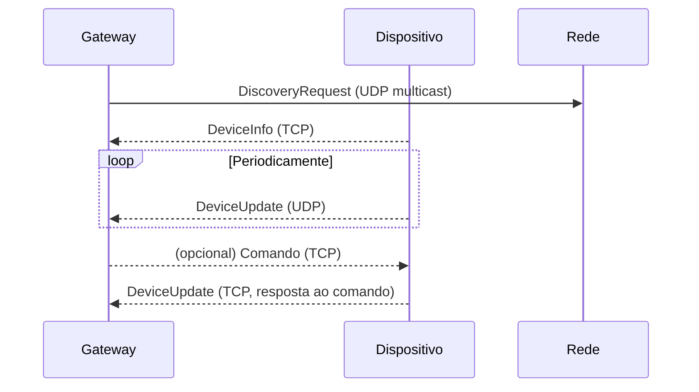

# Lógica de Descoberta – Smart City IoT

Este documento explica como funciona o protocolo de descoberta automática entre o **gateway**, **sensores** e **atuadores** no sistema Smart City, detalhando o fluxo de mensagens, exemplos e o protocolo utilizado.

---

## 1. Visão Geral

A descoberta automática permite que sensores e atuadores encontrem o gateway na rede sem configuração manual de IPs. O processo envolve:
- **Gateway** anunciando sua presença via multicast UDP.
- **Dispositivos** (sensores/atuadores) escutando esse anúncio, registrando-se e, depois, enviando status periodicamente.

---

## 2. Fluxo de Comunicação



---

## 3. Mensagens Utilizadas (baseado no .proto)

### DiscoveryRequest (descoberta)
Enviada pelo gateway via UDP multicast para todos na rede.

```protobuf
message DiscoveryRequest {
  string gateway_ip = 1;
  int32 gateway_tcp_port = 2;
  int32 gateway_udp_port = 3;
}
```

- **Protocolo:** UDP multicast
- **Endereço:** 224.1.1.1:5007
- **Envelope:** Enviada "pura" (não encapsulada em SmartCityMessage)

### DeviceInfo (registro)
Enviada pelo dispositivo para o gateway via TCP após receber o DiscoveryRequest.

```protobuf
message DeviceInfo {
  string device_id = 1;
  DeviceType type = 2;
  string ip_address = 3;
  int32 port = 4;
  DeviceStatus initial_state = 5;
  bool is_actuator = 6;
  bool is_sensor = 7;
}
```

- **Protocolo:** TCP
- **Envelope:** Encapsulada em SmartCityMessage

### DeviceUpdate (status)
Enviada periodicamente pelo dispositivo para o gateway, informando status ou dados sensoriados.

```protobuf
message DeviceUpdate {
  string device_id = 1;
  DeviceType type = 2;
  DeviceStatus current_status = 3;
  TemperatureHumidityData temperature_humidity = 4; // para sensores de temperatura
  // ... outros campos para outros tipos de sensores
}
```

- **Protocolo:** UDP (status periódico) ou TCP (resposta a comando)
- **Envelope:** Encapsulada em SmartCityMessage

---

## 4. Passo a Passo da Descoberta

### 1. Gateway anuncia sua presença
- Envia `DiscoveryRequest` via UDP multicast para 224.1.1.1:5007.
- Mensagem contém IP e portas do gateway.

### 2. Dispositivo escuta e descobre o gateway
- Escuta a porta multicast.
- Ao receber `DiscoveryRequest`, armazena IP/portas do gateway.

### 3. Dispositivo registra-se no gateway
- Envia `DeviceInfo` via TCP para o gateway.
- Gateway adiciona o dispositivo à lista de conectados.

### 4. Dispositivo envia status periodicamente
- Envia `DeviceUpdate` via UDP para o gateway (porta 12346).
- Sensores enviam dados sensoriados; atuadores enviam status ON/OFF.

### 5. Gateway pode enviar comandos (atuadores)
- Comandos são enviados via TCP, encapsulados em SmartCityMessage.
- Atuador responde com DeviceUpdate via TCP.

---

## 5. Comandos para Atuadores
- Atuadores recebem comandos do gateway via TCP (ex: ligar/desligar relé).
- Comandos são encapsulados em SmartCityMessage.
- Atuador responde com DeviceUpdate via TCP.

---

## 6. Comandos para Sensores

Além de enviar dados periodicamente, **sensores também podem receber comandos do gateway** via TCP, encapsulados em `SmartCityMessage`. Os principais comandos são:

- **Alterar frequência de atualização:**
  - O gateway pode enviar um comando para o sensor mudar o intervalo de envio dos dados sensoriados (por exemplo, de 5s para 60s).
  - O sensor ajusta seu temporizador interno conforme o valor recebido.

- **Alterar estado (ex: IDLE/ACTIVE):**
  - O gateway pode colocar o sensor em modo `IDLE`.
  - **Quando em IDLE, o sensor pausa o envio de dados sensoriados** (não envia mais DeviceUpdate via UDP até voltar para ACTIVE).

Esses comandos são importantes para economia de energia, controle dinâmico da rede e gerenciamento remoto dos dispositivos.

---

## 7. Observações
- O uso do envelope `SmartCityMessage` é padrão para todas as mensagens, **exceto DiscoveryRequest**, que é enviada "pura" para simplificar o parsing nos dispositivos embarcados.
- O gateway só considera dispositivos "ativos" se eles enviarem status periodicamente (campo `last_seen` atualizado).
- O filtro de tempo para considerar um dispositivo "ligado" pode ser ajustado no gateway.

---

## 8. Exemplo de Mensagens

### DiscoveryRequest (enviada pelo gateway)
```json
{
  "gateway_ip": "192.168.0.10",
  "gateway_tcp_port": 12345,
  "gateway_udp_port": 12346
}
```

### DeviceInfo (enviada pelo sensor/atuador)
```json
{
  "device_id": "esp8266_temp_01",
  "type": "TEMPERATURE_SENSOR",
  "ip_address": "192.168.0.20",
  "port": 8889,
  "initial_state": "ACTIVE",
  "is_actuator": false,
  "is_sensor": true
}
```

### DeviceUpdate (enviada periodicamente)
```json
{
  "device_id": "esp8266_temp_01",
  "type": "TEMPERATURE_SENSOR",
  "current_status": "ACTIVE",
  "temperature_humidity": {
    "temperature": 23.5,
    "humidity": 60.0
  }
}
```

---

## 9. Referências
- Arquivo `.proto` do projeto
- Código-fonte do gateway, sensores e atuadores 

---

## Frequências de Comunicação

- **Gateway → Dispositivos (DiscoveryRequest):**
  - O gateway envia pacotes de descoberta (`DiscoveryRequest`) via UDP multicast a cada **10 segundos**.

- **Sensores → Gateway (DeviceUpdate):**
  - Sensores enviam status/dados sensoriados (`DeviceUpdate`) via UDP para o gateway a cada **5 segundos** (valor padrão, pode ser alterado por comando).

- **Atuadores → Gateway (DeviceUpdate):**
  - Atuadores enviam status (`DeviceUpdate`) via UDP para o gateway a cada **30 segundos** (valor padrão).

Essas frequências podem ser ajustadas conforme a necessidade do sistema e comandos enviados pelo gateway. 

---

## 10. Envio de Comandos (DeviceCommand) via SmartCityMessage

Comandos enviados do gateway para sensores ou atuadores são sempre encapsulados em um envelope `SmartCityMessage`, dentro do campo `client_request`, que por sua vez contém o campo `command` do tipo `DeviceCommand`.

### Exemplo de envio de comando para alterar a frequência de um sensor

```json
{
  "message_type": "CLIENT_REQUEST",
  "client_request": {
    "type": "SEND_DEVICE_COMMAND",
    "target_device_id": "esp8266_temp_01",
    "command": {
      "command_type": "SET_FREQ",
      "custom_config": "60000"  // nova frequência em ms (ex: 60 segundos)
    }
  }
}
```

- O campo `message_type` indica que é um comando de cliente.
- O campo `target_device_id` define o dispositivo de destino.
- O campo `command_type` define o tipo de comando (ex: `SET_FREQ`, `IDLE`, `TURN_ON`, etc).
- O campo `custom_config` pode conter parâmetros adicionais, como a nova frequência.

O dispositivo faz o parsing do envelope, extrai o comando e executa a ação correspondente. 